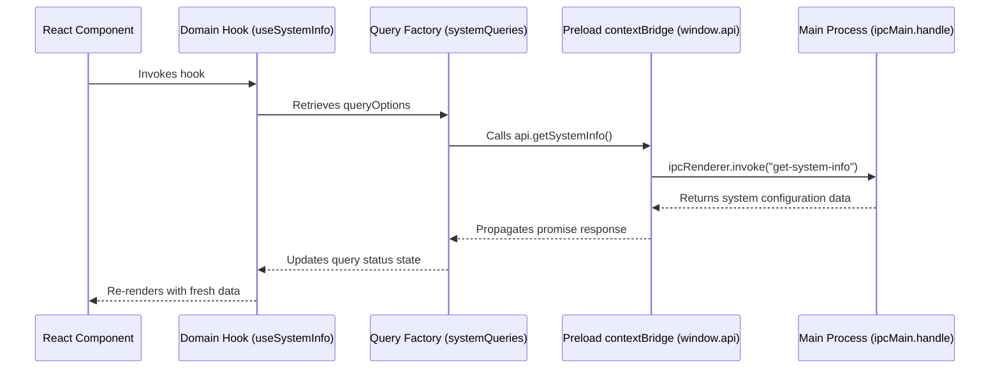

<div align="center">
  
  
  # electron-react-starter-kit
  
  An enterprise-grade, high-performance GitHub template for building cross-platform desktop applications using **Electron**, **React 19**, **TypeScript**, and modern **TanStack** state & routing systems.

  [](https://github.com/AchuAshwath/electron-react-starter-kit/actions)
  [](LICENSE)
  [](https://conventionalcommits.org)
  [](https://biomejs.dev)
</div>

---

## 🚀 Built With

Discover the core stack driving this starter template:

| Technology | Badge | Purpose |
| :--- | :--- | :--- |
| **Electron** |  | Cross-platform desktop runtime framework |
| **React** |  | Dynamic and declarative component UI library |
| **TypeScript** |  | Static typing for enterprise-grade predictability |
| **Vite** |  | Ultra-fast local dev server and assets build pipeline |
| **TanStack Router** |  | Fully type-safe, file-based routing and layout management |
| **TanStack Query** |  | Asynchronous state, loading states, and robust query caching |
| **Tailwind CSS** |  | Utility-first styling with the modern Tailwind v4 compilation |
| **Biome** |  | Blazing fast replacement for ESLint, Prettier, and import organization |

---

## ✨ Features Checklist

* ⚡️ **electron-vite Integration**: Fast Hot Module Replacement (HMR) in renderer and hot-reload in main process.
* 🛡️ **Secure Context Bridge**: Securely isolated main and renderer processes using `contextBridge` to mitigate XSS risks.
* 📦 **Modular Query Factories**: Scalable hierarchy of queries and hooks grouped by feature domain (TkDodo pattern).
* 🗂 **File-Based Routing**: Type-safe layout, nested routes, and automated routing tree generation via TanStack Router.
* 🎨 **Modern Theming (Shadcn/ui)**: Clean base system with Tailwind v4 styling, customized dark/light layout, and standard UI blocks.
* 🛠 **Git Guardrails & Hooks**: Automated staging checks (`lint-staged`), Conventional Commits verification (`commitlint`), and git hooks (`Husky`).
* 🤖 **Continuous Integration**: Seamless GitHub Actions workflow verifying formatting, linting, types, and builds.
* 📦 **Desktop Packaging**: Ready-to-go `electron-builder` configuration for building production Windows, macOS, and Linux apps.

---

## 📂 Project Structure

```text
.
├── .github/workflows/ci.yml   # Automatic lint, check, and build verification
├── .husky/                    # Commit-message, pre-commit, and pre-push hooks
├── resources/                 # Static branding assets (app icons)
├── src/
│   ├── main/
│   │   └── index.ts           # Electron main process (lifecycle & IPC handlers)
│   ├── preload/
│   │   ├── index.ts           # Exposes secure contextBridge APIs to the renderer
│   │   └── index.d.ts         # Global window typescript definitions
│   └── renderer/
│       ├── index.html         # Main app HTML window container
│       └── src/
│           ├── main.tsx       # Renderer app entry point
│           ├── env.d.ts       # Global build environmental typings
│           ├── routeTree.gen.ts # Router auto-generated routing tree
│           ├── assets/        # Styles, icons, and theme configuration
│           ├── components/    # Reusable shared components
│           ├── core/
│           │   └── system/    # Domain-specific Query Factory (queries, hooks, types)
│           ├── lib/
│           │   ├── query-client.ts # Configured React Query client configuration
│           │   └── utils.ts   # Style merging utilities
│           └── routes/        # Layout and route components
├── tsconfig.json              # TypeScript workspace compiler settings
├── biome.json                 # Formatting and linting configuration
└── electron-builder.yml       # Production packaging options
```

---

## 🛠 Getting Started

### Prerequisites

You need [Node.js](https://nodejs.org/) (v22 or newer) and [pnpm](https://pnpm.io/) (v10 or newer) installed.

### Installation

1. **Clone the repository:**
   ```bash
   git clone https://github.com/AchuAshwath/electron-react-starter-kit.git
   cd electron-react-starter-kit
   ```

2. **Install dependencies:**
   ```bash
   pnpm install
   ```

3. **Start local development:**
   ```bash
   pnpm dev
   ```

---

## 🔄 IPC & Querying Architecture

This starter kit implements the **TkDodo Query Factory pattern** for seamless and type-safe main-to-renderer communication.



### Adding a New IPC Route & Query

1. **Expose IPC endpoint in `src/main/index.ts`:**
   ```typescript
   ipcMain.handle("get-custom-data", async (_, args) => {
       return { success: true, data: "Hello World" };
   });
   ```

2. **Add preload bridge in `src/preload/index.ts` & `index.d.ts`:**
   ```typescript
   // index.ts
   const api = {
       getCustomData: () => ipcRenderer.invoke("get-custom-data"),
   };
   
   // index.d.ts
   interface Window {
       api: {
           getCustomData: () => Promise<{ success: boolean; data: string }>;
       };
   }
   ```

3. **Incorporate into Domain Query Factory (`src/renderer/src/core/system/`)**:
   ```typescript
   export const systemQueries = {
       // ...
       customData: () =>
           queryOptions({
               queryKey: [...systemQueries.all(), "custom"],
               queryFn: () => window.api.getCustomData(),
               staleTime: 60 * 1000, // cache fresh for 1 minute
           }),
   };
   ```

---

## 📜 Available Scripts

| Script | Command | Purpose |
| :--- | :--- | :--- |
| `pnpm dev` | `electron-vite dev` | Starts development server with HMR and Hot Reload |
| `pnpm build` | `npm run typecheck && electron-vite build` | Compiles processes and tests type safety |
| `pnpm lint` | `biome check .` | Runs high-speed linting and analysis checks |
| `pnpm format` | `biome format --write .` | Formats all workspace source files |
| `pnpm typecheck` | `typecheck:node && typecheck:web` | Validates TypeScript compliance across all processes |
| `pnpm test` | `vitest run` | Runs the unit test suite once |
| `pnpm test:watch` | `vitest` | Starts Vitest in watch mode for local development |
| `pnpm test:coverage` | `vitest run --coverage` | Runs unit tests and writes a V8 coverage report |
| `pnpm ci` | `pnpm lint && pnpm format:check && pnpm typecheck && pnpm test && pnpm build` | Local verification mimicking full CI run |

---

## Testing Convention

Tests live beside the source files they cover using the `*.test.ts` or `*.test.tsx` suffix. This keeps behavior, implementation, and regression coverage easy to review together as each feature grows.

```text
src/renderer/src/lib/utils.ts
src/renderer/src/lib/utils.test.ts

src/renderer/src/core/system/system.queries.ts
src/renderer/src/core/system/system.queries.test.ts

src/renderer/src/core/system/system.hooks.ts
src/renderer/src/core/system/system.hooks.test.tsx
```

For TkDodo-style Query Factories, test the query key hierarchy and the preload bridge call beside the query file. Hook and component tests should use Testing Library with a fresh `QueryClient` per test from `src/renderer/src/test/render.tsx`.

---

## 📅 Roadmap

- [x] Electron + React 19 + TypeScript base split
- [x] Biome rapid code styling lint & format setup
- [x] Fully integrated Husky, lint-staged, and commitlint commit guardrails
- [x] GitHub Actions CI automated pipeline setup
- [x] Responsive layout shell using shadcn/ui components
- [x] File-based routing via TanStack Router
- [x] TkDodo modular Query Factory pattern with TanStack Query
- [x] Establish Vitest + Testing Library unit test suite
- [ ] Implement secure electron-store / SafeStorage user configuration caching
- [ ] Add theme switcher with persisted light/dark/system preference
- [ ] Unified desktop application updater integration and configuration
