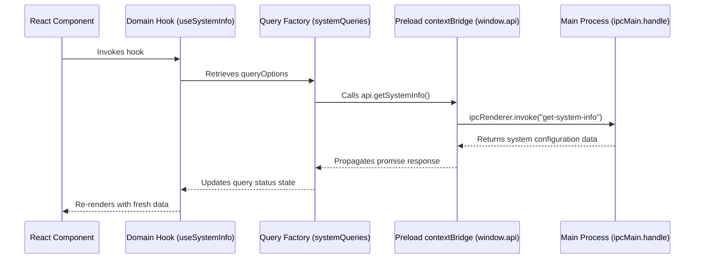
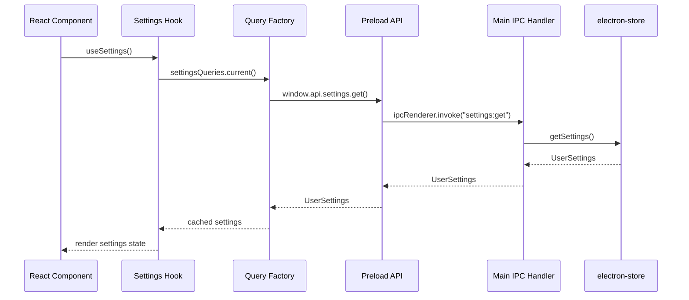
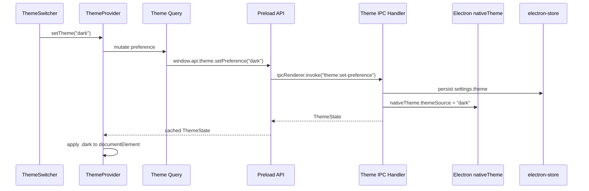

<div align="center">
  
  
  # electron-react-starter-kit
  
  An enterprise-grade, high-performance GitHub template for building cross-platform desktop applications using **Electron**, **React 19**, **TypeScript**, and modern **TanStack** state & routing systems.

  [](https://github.com/AchuAshwath/electron-react-starter-kit/actions)
  [](LICENSE)
  [](https://conventionalcommits.org)
  [](https://biomejs.dev)
</div>

---

## 🚀 Built With

Discover the core stack driving this starter template:

| Technology | Badge | Purpose |
| :--- | :--- | :--- |
| **Electron** |  | Cross-platform desktop runtime framework |
| **React** |  | Dynamic and declarative component UI library |
| **TypeScript** |  | Static typing for enterprise-grade predictability |
| **Vite** |  | Ultra-fast local dev server and assets build pipeline |
| **TanStack Router** |  | Fully type-safe, file-based routing and layout management |
| **TanStack Query** |  | Asynchronous state, loading states, and robust query caching |
| **Tailwind CSS** |  | Utility-first styling with the modern Tailwind v4 compilation |
| **shadcn/ui** |  | Accessible component primitives styled with Tailwind CSS |
| **electron-store** |  | Main-process persistence for normal user preferences |
| **Zod** |  | Runtime validation for IPC payloads and settings contracts |
| **Vitest** |  | Unit and component testing for renderer and main-process modules |
| **Biome** |  | Blazing fast replacement for ESLint, Prettier, and import organization |

---

## ✨ Features Checklist

* ⚡️ **electron-vite Integration**: Split main, preload, and renderer builds with fast HMR in development and production bundling through Vite.
* 🛡️ **Preload-First Electron API**: Renderer code uses a typed `window.api` surface instead of importing Electron or calling `ipcRenderer` directly.
* 📦 **Modular Query Factories**: Feature-specific TanStack Query factories and hooks keep IPC-backed renderer state predictable and easy to test.
* 🗂 **File-Based Routing**: TanStack Router provides generated route types, nested layouts, and route-level code organization.
* 🎨 **Modern UI Foundation**: Tailwind CSS v4, shadcn/ui-style primitives, lucide icons, and shared utilities are preconfigured.
* 🌓 **Desktop-Aware Theme Switching**: Light, dark, and system themes are persisted through main-process settings and resolved with Electron `nativeTheme`.
* 💾 **Validated User Settings**: `electron-store` persists normal preferences, while Zod validates settings updates at the IPC boundary.
* **Native File Upload Demo**: Electron open/save dialogs, drag-and-drop path handling, shadcn-style file rows, and session-scoped upload state are wired through preload-safe APIs.
* 🧪 **Testing Setup**: Vitest, Testing Library, jsdom, coverage, and local test helpers are ready for main-process services, query factories, hooks, and components.
* 🛠 **Git Guardrails & Hooks**: Husky, lint-staged, and commitlint enforce formatting, linting, and Conventional Commits.
* 🤖 **Continuous Integration**: GitHub Actions verifies install, lint, format, typecheck, tests, and production build.
* 📦 **Desktop Packaging**: `electron-builder` is configured for Windows, macOS, and Linux builds with starter icons and platform resources.

---

## 📂 Project Structure

```text
.
├── .github/workflows/ci.yml     # Automatic lint, typecheck, test, and build verification
├── .husky/                      # Commit-message, pre-commit, and pre-push hooks
├── resources/                   # Runtime app assets
├── build/                       # Platform icons, entitlements, and build resources
├── src/
│   ├── main/
│   │   ├── index.ts             # Electron lifecycle, BrowserWindow, and IPC registration
│   │   ├── ipc/                 # Typed IPC handler registrar, validation, and safe errors
│   │   ├── settings/            # Zod-validated electron-store settings module
│   │   └── theme/               # nativeTheme integration and theme IPC handlers
│   ├── preload/
│   │   ├── index.ts             # Typed contextBridge API exposed to the renderer
│   │   └── index.d.ts           # Global window API types
│   └── renderer/
│       ├── index.html           # CSP and renderer mount point
│       └── src/
│           ├── main.tsx         # React, Router, Query Client, and providers
│           ├── env.d.ts         # Renderer environment typings
│           ├── routeTree.gen.ts # TanStack Router generated route tree
│           ├── assets/          # Global CSS and static renderer assets
│           ├── components/      # Shared UI and feature components
│           ├── core/
│           │   ├── settings/    # Settings queries and hooks
│           │   ├── system/      # System info queries and hooks
│           │   └── theme/       # Theme provider, hooks, queries, and DOM helpers
│           ├── lib/             # Query client and shared utilities
│           ├── routes/          # File-based route modules
│           └── test/            # Testing Library setup and render helpers
├── vitest.config.ts             # Vitest, jsdom, Testing Library, and coverage setup
├── tsconfig*.json               # TypeScript configs for node and web targets
├── biome.json                   # Formatting, linting, and import organization
└── electron-builder.yml         # Production packaging options
```

---

## 🛠 Getting Started

### Prerequisites

You need [Node.js](https://nodejs.org/) (v22 or newer) and [pnpm](https://pnpm.io/) (v10 or newer) installed.

### Installation

1. **Clone the repository:**
   ```bash
   git clone https://github.com/AchuAshwath/electron-react-starter-kit.git
   cd electron-react-starter-kit
   ```

2. **Install dependencies:**
   ```bash
   pnpm install
   ```

3. **Start local development:**
   ```bash
   pnpm dev
   ```

---

## 🔄 IPC & Querying Architecture

This starter kit implements a typed IPC platform around Electron's `ipcMain.handle` / `ipcRenderer.invoke` flow and the **TkDodo Query Factory pattern**. The current preload API exposes app version, system info, settings, theme, dialog, and file path capabilities through `window.api`, while the renderer consumes those APIs through feature-specific query factories and hooks.

Main-process handlers are registered through `createIpcHandlerRegistrar`, which applies trusted sender validation before handler execution, validates request payloads with Zod when a schema is provided, and converts thrown errors into renderer-safe messages such as `BAD_REQUEST: Invalid IPC request payload.`. Renderer code should treat the rejected error `message` as the stable error contract because Electron does not preserve custom error fields across `ipcRenderer.invoke`.



### Adding a New IPC Route & Query

1. **Register the IPC handler with the typed main-process registrar:**
   ```typescript
   import { z } from "zod";
   import type { IpcHandlerRegistrar } from "../ipc/ipc-handler";

   const customRequestSchema = z.object({
       id: z.string().min(1),
   });

   export function registerCustomIpcHandlers(
       registerIpcHandler: IpcHandlerRegistrar,
   ): void {
       registerIpcHandler({
           channel: "custom:get",
           input: customRequestSchema,
           handler: (input) => {
               return { success: true, id: input.id };
           },
       });
   }
   ```

   Wire the feature registrar from `src/main/index.ts`:
   ```typescript
   registerCustomIpcHandlers(registerIpcHandler);
   ```

2. **Add preload bridge in `src/preload/index.ts` & `index.d.ts`:**
   ```typescript
   // index.ts
   const api = {
       custom: {
           get: (id: string) => ipcRenderer.invoke("custom:get", { id }),
       },
   };
   
   // index.d.ts
   interface Window {
       api: {
           custom: {
               get: (id: string) => Promise<{ success: boolean; id: string }>;
           };
       };
   }
   ```

3. **Incorporate into a domain Query Factory (`src/renderer/src/core/<feature>/`)**:
   ```typescript
   export const systemQueries = {
       // ...
       customData: (id: string) =>
           queryOptions({
               queryKey: [...systemQueries.all(), "custom", id],
               queryFn: () => window.api.custom.get(id),
               staleTime: 60 * 1000, // cache fresh for 1 minute
           }),
    };
    ```

---

## User Settings Storage

User preferences are persisted in the Electron main process with `electron-store`. Renderer code does not read or write storage directly; it talks to the typed preload API, which forwards requests to validated IPC handlers.



Settings updates are validated with Zod at the IPC boundary before they reach persistence:

```typescript
ipcMain.handle(settingsIpcChannels.update, (_, patch: unknown) => {
    const parsedPatch = userSettingsPatchSchema.parse(patch);

    return updateSettings(parsedPatch);
});
```

Normal user preferences such as theme choice, window bounds, and startup options belong in `electron-store`. Sensitive values such as access tokens, refresh tokens, API keys, and passwords should live in a separate secret-storage module backed by Electron `safeStorage`.

---

## Theme Switching

Theme switching follows the same IPC and Query Factory architecture as settings, with Electron's `nativeTheme` acting as the desktop-aware source for resolving system preference.



The renderer does not duplicate persisted theme state in `localStorage`. The main process reads `settings.theme`, asks Electron to resolve the final light or dark mode, and sends a typed `ThemeState` through preload:

```typescript
type ThemeState = {
    preference: "system" | "light" | "dark";
    resolvedTheme: "light" | "dark";
    systemPrefersDark: boolean;
};
```

To reduce first-paint flicker, the main process passes the initial theme state into the renderer URL before the window loads. The renderer seeds React Query from that value and applies the shadcn-compatible `light` or `dark` class before React renders. Runtime OS theme changes are delivered through `window.api.theme.onUpdated`, which returns an unsubscribe callback for React effects.

Theme tests live beside the files they cover: main-process service tests cover `nativeTheme` integration, query tests cover preload calls, and provider/component tests cover root class application and user interaction.

---

## Native File Uploads

The starter kit includes a complete native file upload demo that keeps Electron-only capabilities outside the renderer. The main process owns `dialog.showOpenDialog()` and `dialog.showSaveDialog()` through typed IPC handlers in `src/main/dialog`, preload exposes narrow `window.api.dialog` and `window.api.files` methods, and the renderer consumes those APIs through `src/renderer/src/core/dialog` hooks.

The home route demonstrates both selection paths: the Choose button opens Electron's native multi-file dialog, while drag-and-drop receives browser `File` objects and asks preload to resolve safe file paths with `webUtils.getPathForFile(file)`. Selected paths are stored in the TanStack Query cache for the current app session, so navigating away and back preserves the demo state without writing file selections to `electron-store`. Persistent recent files should be added as a separate feature when an app actually needs that behavior.

The reusable `FileUpload` component supports single or multiple files, max-file limits, removable path rows, long-path truncation, and shadcn/Base UI tooltips for inspecting full file names and paths.

---

## 📜 Available Scripts

| Script | Command | Purpose |
| :--- | :--- | :--- |
| `pnpm dev` | `electron-vite dev` | Starts development server with HMR and Hot Reload |
| `pnpm build` | `npm run typecheck && electron-vite build` | Compiles processes and tests type safety |
| `pnpm lint` | `biome check .` | Runs high-speed linting and analysis checks |
| `pnpm format` | `biome format --write .` | Formats all workspace source files |
| `pnpm typecheck` | `typecheck:node && typecheck:web` | Validates TypeScript compliance across all processes |
| `pnpm test` | `vitest run` | Runs the unit test suite once |
| `pnpm test:watch` | `vitest` | Starts Vitest in watch mode for local development |
| `pnpm test:coverage` | `vitest run --coverage` | Runs unit tests and writes a V8 coverage report |
| `pnpm ci` | `pnpm lint && pnpm format:check && pnpm typecheck && pnpm test && pnpm build` | Local verification mimicking full CI run |

---

## Testing Convention

Tests live beside the source files they cover using the `*.test.ts` or `*.test.tsx` suffix. This keeps behavior, implementation, and regression coverage easy to review together as each feature grows.

```text
src/renderer/src/lib/utils.ts
src/renderer/src/lib/utils.test.ts

src/renderer/src/core/system/system.queries.ts
src/renderer/src/core/system/system.queries.test.ts

src/renderer/src/core/theme/theme-provider.tsx
src/renderer/src/core/theme/theme-provider.test.tsx

src/main/settings/settings.store.ts
src/main/settings/settings.store.test.ts
```

For TkDodo-style Query Factories, test the query key hierarchy and the preload bridge call beside the query file. Main-process services, such as settings and theme behavior, should keep focused service tests near their implementation. Hook and component tests should use Testing Library with a fresh `QueryClient` per test from `src/renderer/src/test/render.tsx`.

---

## 📅 Roadmap

The roadmap is ordered so each milestone builds on the previous one. Each item should stay small enough to complete, test, and review as its own focused branch.

### Phase 1: Electron Runtime Security Foundation

- [x] **Harden `BrowserWindow` security**: Explicitly configure secure defaults for context isolation, renderer Node.js integration, sandboxing, web security, insecure content, experimental features, and preload usage.
- [x] **Centralize Electron security policies**: Keep renderer URL validation, external URL policy, navigation handling, permission handling, and secure web preferences in a dedicated main-process security module.
- [x] **Restrict development renderer loading**: Allow dev `loadURL` only for local Vite loopback URLs.
- [x] **Add restrictive renderer CSP**: Keep renderer content constrained with `default-src 'self'`, `script-src 'self'`, and explicit source directives.
- [x] **Block unexpected renderer navigation**: Prevent top-level renderer navigation away from the loaded app document.
- [x] **Deny new window creation**: Use `setWindowOpenHandler` to deny renderer-created windows by default.
- [x] **Validate external URLs before `shell.openExternal`**: Allow only safe external protocols such as `https:` and `mailto:`.
- [x] **Default-deny session permission requests**: Deny runtime permission prompts until a feature-specific permission flow is added.

### Phase 2: Typed IPC and Trusted Main APIs

- [x] **Add a typed IPC contract helper**: Create a small pattern for channel names, Zod request validation, typed responses, trusted sender validation, and consistent error serialization.
- [x] **Validate IPC sender frames**: Ensure IPC handlers only accept messages from trusted app frames/origins.
- [x] **Standardize IPC errors**: Return predictable, renderer-safe error messages without leaking main-process internals.
- [x] **Migrate system IPC to the helper**: Move app version and system info IPC onto the shared contract pattern.
- [x] **Migrate settings IPC to the helper**: Keep Zod validation at the IPC boundary while standardizing handler registration and errors.
- [x] **Migrate theme IPC to the helper**: Keep theme events and mutations typed while preserving native theme behavior.
- [x] **Document the IPC feature recipe**: Show how to add a new main/preload/renderer query path without exposing raw Electron APIs.

### Phase 3: Safe Platform APIs

- [ ] **Add SafeStorage-backed secrets**: Store tokens, API keys, and other sensitive values through Electron `safeStorage`, separate from normal `electron-store` preferences.
- [x] **Add file picker/save dialog APIs**: Expose typed main-process wrappers for open/save dialogs through preload, support drag-and-drop file path resolution, and document the recommended renderer usage.
- [ ] **Add native notifications module with permission UI**: Provide a typed notification API, default-deny permission policy, renderer hooks, and user-facing permission/request states.

### Phase 4: Auth Foundation

Add auth after the trusted IPC and safe platform API foundations are in place. Auth should reuse the typed IPC helper and SafeStorage-backed persistence rather than introducing its own storage path.

- [ ] **Add shared auth types**: Define session, user, sign-in, and sign-out contracts that can be imported by main, preload, and renderer code.
- [ ] **Add `FakeAuthProvider` in main**: Use `safeStorage` for sensitive session material and `electron-store` for non-sensitive auth metadata.
- [ ] **Add auth IPC handlers**: Register typed handlers for reading the current session, signing in, and signing out.
- [ ] **Expose `window.api.auth`**: Keep renderer auth access behind preload, matching the rest of the app API.
- [ ] **Add renderer auth modules**: Create `auth.client.ts`, `auth.queries.ts`, and `auth.hooks.ts`.
- [ ] **Split routes into auth and app groups**: Move current routes into `(auth)` and `(app)` route groups.
- [ ] **Add protected app layout**: Add an `(app)/route.tsx` layout guard that redirects unauthenticated users to `/login`.
- [ ] **Add a simple login screen**: Call fake `signIn` and hydrate the session query on success.
- [ ] **Add sign out**: Clear the session query and navigate back to `/login`.

Key design rule: file-based routing owns access control, TanStack Query owns session state, and the main-process auth provider owns persistence. That keeps fake auth realistic without making it hard to replace later.

### Phase 5: Reliability and Observability

- [ ] **Add window state persistence**: Restore, validate, and save window bounds while preventing off-screen launches.
- [ ] **Add error boundary and crash handling**: Provide renderer error boundaries, main-process uncaught error handling, and renderer crash/reload behavior.
- [ ] **Add `electron-log`**: Centralize app logs for main, preload, and renderer paths with production-friendly file output.

### Phase 6: Distribution and Configuration

- [ ] **Add typed env config with `import.meta.env`**: Provide `.env.example`, typed renderer env variables, and clear separation between build-time renderer config and main-process secrets.
- [ ] **Add the auto update flow**: Implement `electron-updater` service, IPC events, renderer update UI, progress states, and production publish configuration.
- [ ] **Evaluate a custom app protocol**: Consider replacing production `file://` loading with a privileged custom protocol once the packaging path is stable.
- [ ] **Evaluate Electron fuses**: Review Electron fuse settings during distribution hardening.
- [ ] **Define dependency update policy**: Keep Electron and security-sensitive dependencies current with documented update checks.
