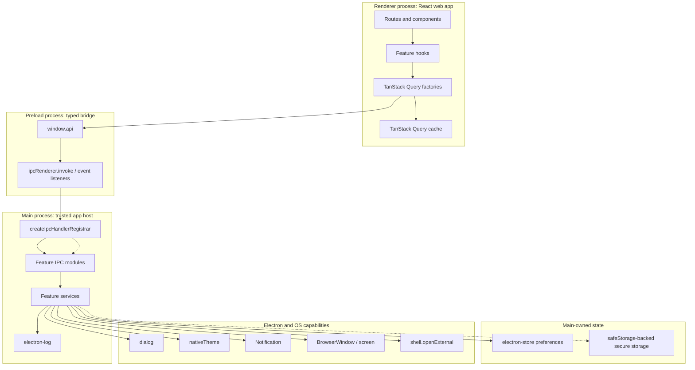
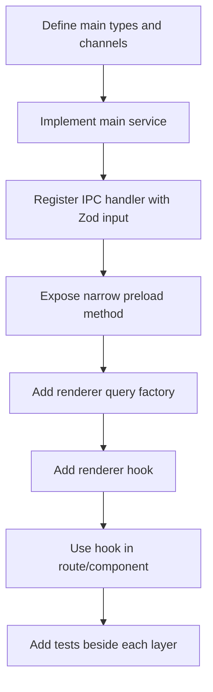

# Starter Kit Documentation

This is the implementation manual for `electron-react-starter-kit`. The root README is the polished landing page; these docs explain the coding patterns, extension points, and feature wiring that future apps should follow.

Core guides describe behavior that exists in the starter today. Optional recipes live under `docs/examples/` and describe patterns an app may choose to implement later.

## Architecture Mental Model

The architecture is not a single left-to-right chain. It is a process-boundary design: renderer code stays web-like, preload is the typed bridge, and the main process owns Electron capabilities, persistence, logging, and secrets.



Dotted arrows mark important policy boundaries: IPC calls pass trusted-sender and Zod validation before feature handlers run, and sensitive values should move through a secure-storage path rather than normal settings.

The renderer is treated like a web app. Electron capabilities stay in main or preload, and renderer code receives a narrow typed API through `window.api`. If a feature needs Electron, storage, or OS access, model it as a main-owned capability first and then expose the smallest renderer API that can drive it.

## Viewing Diagrams In VS Code

The docs use fenced `mermaid` blocks. GitHub renders them automatically.

In VS Code, first try the normal Markdown preview with `Ctrl+Shift+V` or **Markdown: Open Preview to the Side**. Do not open these files with a dedicated **Mermaid Preview** command. Those commands often expect the whole file to be Mermaid source instead of Markdown containing Mermaid fences, which can produce `No diagram type detected`.

If a diagram appears and then disappears, the usual cause is a preview extension conflict. Close the preview tab, reload the VS Code window, and temporarily disable Markdown/Mermaid preview extensions that replace VS Code's built-in Markdown preview. Keep only one Mermaid renderer active for Markdown preview.

## Diagram Conventions

Use the diagram shape that matches the concept:

- Process boundaries use `flowchart TB` with subgraphs for renderer, preload, main, state, and platform capabilities.
- Request/response flows use `sequenceDiagram` so the IPC or query lifecycle is readable step by step.
- Linear build or route-generation pipelines can use `flowchart LR` because the left-to-right shape matches the work.
- Optional or planned behavior should be labeled in text, not mixed into shipped architecture as if it already exists.

## Repo Coding Patterns

### Feature slices

Features are organized around the process boundary they belong to:

```text
src/main/<feature>/              # Electron API, persistence, IPC handlers, services
src/renderer/src/core/<feature>/ # Query factories, hooks, renderer-side types
src/renderer/src/routes/         # Route modules and layout groups
src/preload/                     # The typed bridge between renderer and main
```

A feature that crosses the Electron boundary usually has this shape:

```text
src/main/example/example.channels.ts
src/main/example/example.types.ts
src/main/example/example.service.ts
src/main/example/example.ipc.ts
src/main/example/example.*.test.ts
src/renderer/src/core/example/example.queries.ts
src/renderer/src/core/example/example.hooks.ts
src/renderer/src/core/example/example.*.test.ts
```

Small features can omit files that do not carry their weight. Keep the same direction of dependency even when the file count is smaller.

### Main process rules

The main process owns:

- Electron APIs such as `BrowserWindow`, `dialog`, `Notification`, `nativeTheme`, `screen`, and `shell`.
- Persistence through `electron-store`.
- Secure storage through Electron `safeStorage` or provider-specific OS-backed credential APIs.
- IPC handler registration and validation.
- Production diagnostics and platform side effects.

Do not let renderer components import Electron, read the filesystem, own tokens, or directly mutate platform state.

### Preload rules

Preload exposes a narrow `window.api` surface with `contextBridge`. Each method should map to a specific app capability, not a generic escape hatch.

Good preload API:

```ts
window.api.settings.update({ theme: "dark" });
window.api.dialog.openFile({ multiple: true });
```

Avoid generic APIs such as:

```ts
window.api.invoke(channel, payload);
window.api.readFile(path);
```

The first bypasses typed contracts. The second turns the renderer into a filesystem authority.

### Renderer rules

Renderer code should use hooks and query factories:

```tsx
const settingsQuery = useSettings();
const setTheme = useSetThemePreference();
```

Do not call `window.api` directly from most components. Keep preload calls in `core/<feature>` so routes stay declarative and tests stay focused.

### Validation and errors

Validate renderer-provided input at the IPC boundary with Zod. Throw renderer-safe error messages from IPC handlers. Electron does not preserve custom error fields across `ipcRenderer.invoke`, so this starter treats the forwarded `Error.message` as the stable contract.

### State placement

Use the narrowest state location that fits the lifetime:

- Component state for local UI-only state.
- TanStack Query cache for session state that should survive route navigation.
- `electron-store` for normal durable user preferences.
- Future secret storage for tokens, API keys, passwords, and refresh material.
- Main-process services for Electron platform state.

### Testing convention

Tests live beside the files they cover:

```text
src/main/window/window-state.ts
src/main/window/window-state.test.ts

src/renderer/src/core/theme/theme.queries.ts
src/renderer/src/core/theme/theme.queries.test.ts
```

Prefer focused service, IPC, query, hook, and component tests over large end-to-end tests for starter-kit infrastructure.

## Add A New Electron-Backed Feature



Checklist:

1. Put platform logic in `src/main/<feature>`.
2. Validate IPC inputs with Zod when the renderer sends data.
3. Wire the feature from `src/main/index.ts` using the shared IPC registrar.
4. Add a narrow method to `window.api` in preload and type it in `index.d.ts`.
5. Add query factories and hooks under `src/renderer/src/core/<feature>`.
6. Consume hooks from routes/components.
7. Add tests for service logic, IPC registration, query factories, hooks, or components as appropriate.
8. Document the feature in `docs/` if it is part of the core starter.

## Core Guides

- [TanStack Router](tanstack-router.md): route tree, `(app)` layout, pathless groups, route examples, fallbacks, and route checks.
- [Error Boundaries](error-boundaries.md): root/auth/app route fallbacks, retry UI, not-found UI, and redirect behavior.
- [Auth Routing](auth-routing.md): auth/app route groups, guarded app shell, login/signup routes, and safe `returnTo`.
- [Auth Session Contract](auth-session-contract.md): provider-neutral session contract, `DevAuthProvider`, secure credential restore, IPC shape, hooks, and replacement pattern.
- [Secure Storage](secure-storage.md): main-process encrypted storage, auth credential namespacing, failure behavior, and provider boundaries.
- [TanStack Query](tanstack-query.md): query client, query factories, mutations, cache lifetimes, and testing.
- [UI Foundation](ui-foundation.md): Tailwind, shadcn-style primitives, component layering, icons, and feedback patterns.
- [System Info](system-info.md): the smallest complete IPC + Query example for stable process metadata.
- [Typed IPC](typed-ipc.md): main handler registration, validation, trusted sender checks, preload bridge, and end-to-end feature wiring.
- [Electron Security](electron-security.md): secure BrowserWindow defaults, CSP, navigation, external URLs, permission handling, and IPC trust.
- [Settings](settings.md): `electron-store`, schemas, update flow, settings broadcasts, and adding new preferences.
- [Theme](theme.md): `nativeTheme`, first-paint hydration, provider flow, runtime OS updates, and theme-aware UI.
- [File Dialogs and Upload](file-dialogs-and-upload.md): native dialogs, drag/drop path resolution, file upload UI, and session-only file state.
- [Notifications](notifications.md): native support checks, opt-in storage, focus-aware delivery, and notification hooks.
- [Window State](window-state.md): bounds restore, off-screen fallback, debounced persistence, and extension points.
- [Logging](logging.md): scoped main-process logs, event logging, sensitive-data rules, and logger examples.
- [Testing](testing.md): main service tests, IPC tests, query tests, hook tests, and component tests.
- [Packaging](packaging.md): build scripts, packaged assets, and packaging boundaries.
- [Roadmap](roadmap.md): core starter roadmap and optional recipe roadmap.

## Examples / Recipes

- [Auth-ready architecture](examples/auth-ready-architecture.md): provider-neutral auth model with Microsoft Entra/MSAL as an example.
- [Auth Provider Contract Notes](examples/auth-provider-contract.md): optional provider strategy ideas that build on the shipped core contract.
- [Secure Storage Notes](examples/secure-storage.md): optional provider-secret guidance that builds on the shipped secure storage module.
- [Imported file workflow](examples/imported-file-workflow.md): optional durable file import spec.
- [Auto-update](examples/auto-update.md): optional update architecture and deployment-dependent choices.
- [Distribution hardening](examples/distribution-hardening.md): code signing, fuses, custom protocol, and dependency checklist.

## Documentation Rule

If every app should inherit the behavior, document it in `docs/`. If the choice depends on client infrastructure, backend, deployment, identity provider, or product workflow, document it in `docs/examples/`.
