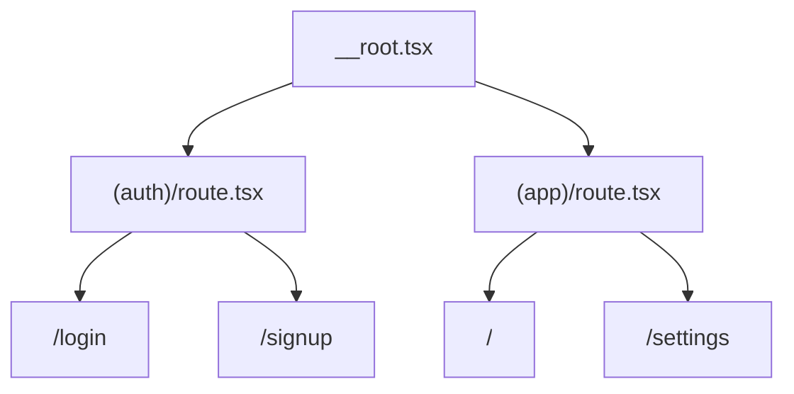

# Auth Routing

This branch ships auth routes for Microsoft 365 sign-in and sign-up. Auth pages stay outside the app shell, while protected app routes live under the `(app)` group.

## Current Shape

```text
src/renderer/src/routes/
|-- (auth)/
|   |-- route.tsx      # auth layout group with auth fallbacks
|   |-- login.tsx      # /login
|   `-- signup.tsx     # /signup
`-- (app)/
    |-- route.tsx      # guarded app shell layout with app fallbacks
    |-- index.tsx      # /
    `-- settings.tsx   # /settings
```

`(auth)` and `(app)` are pathless TanStack Router groups. They add layout, guard, and fallback behavior without adding URL segments.



## Auth Routes

The login and signup routes own navigation and sanitized redirect parsing. They render the reusable auth form and call the auth session hooks.

```tsx
<AuthForm
	mode="login"
	onSuccess={handleSignIn}
	isLoading={signIn.isPending}
	errorMessage={signIn.error?.message}
	returnTo={search.returnTo}
/>
```

Both login and signup call the same Microsoft identity flow:

```ts
const signIn = useSignIn({ strategy: "microsoft" });
```

The UI has one working action: **Continue with Microsoft**. Future database behavior can decide whether that Microsoft identity maps to an existing app user or starts onboarding for a new app user. No username/password/JWT backend flow is installed in this branch.

## App Route Guard

The `(app)` layout checks the auth session before rendering protected routes:

```tsx
beforeLoad: async ({ context, location }) => {
	const session = await context.queryClient.ensureQueryData(
		authQueries.session(),
	);

	if (!session) {
		throw redirect({
			to: "/login",
			search: { returnTo: location.href },
		});
	}
}
```

This keeps the guard at the shell boundary instead of duplicating checks in every app route.

## Error And Pending Behavior

Auth routes and app routes both wire route-specific fallback components from `route-fallbacks.tsx`.

```text
missing session       -> redirect to /login
session check loading -> route pending fallback
auth IPC failure      -> auth/app error fallback
unknown URL           -> root not-found fallback
```

A missing session is expected control flow, not an error. Only failed IPC calls, failed route loaders, or render crashes should reach error boundaries. See [Error Boundaries](error-boundaries.md).

## Safe returnTo Parsing

The login and signup routes accept an optional `returnTo` search parameter. The parser runs through `getSafeRedirectUrl`:

```tsx
const searchSchema = z.object({
	returnTo: z
		.string()
		.optional()
		.transform((value) => getSafeRedirectUrl(value))
		.catch(undefined),
});
```

Only same-app relative paths are allowed. Empty values, absolute URLs, and protocol-relative URLs are discarded.

```ts
getSafeRedirectUrl("/settings"); // "/settings"
getSafeRedirectUrl("https://example.com"); // undefined
getSafeRedirectUrl("//example.com"); // undefined
```

This prevents open redirects while still letting route guards send users back to their original in-app destination.

## Why No auth/index.ts Barrel?

This repo generally imports concrete modules instead of adding barrels for one export. Auth routes import the form directly:

```tsx
import { AuthForm } from "@renderer/components/auth/auth-form";
```

Add a barrel only when the auth folder grows into a stable public component surface with multiple exports that are commonly consumed together.

## Provider Scope

Core auth for this branch uses Microsoft auth documented in [Auth Session Contract](auth-session-contract.md). Other provider integrations such as Google, Auth0/Okta, activation-code, OS/domain gate, or custom backend auth belong in optional recipes and client apps.
