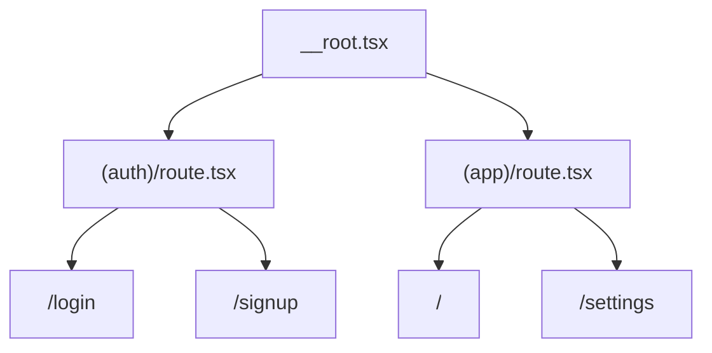

# Auth Routing

The starter ships an auth route scaffold, not a complete auth system. It gives apps a ready place to build sign-in screens while keeping provider choice, session IPC, token storage, and route guards separate follow-up work.

## Current Shape

```text
src/renderer/src/routes/
|-- (auth)/
|   |-- route.tsx      # auth layout group
|   |-- login.tsx      # /login
|   `-- signup.tsx     # /signup
`-- (app)/
    |-- route.tsx      # app shell layout
    |-- index.tsx      # /
    `-- settings.tsx   # /settings
```

`(auth)` is a pathless TanStack Router group. It keeps auth pages out of the app shell without adding an `auth` URL segment.



## AuthForm Pattern

The auth UI is a single composed form component:

```text
src/renderer/src/components/auth/auth-form.tsx
```

Routes choose the mode:

```tsx
<AuthForm mode="login" onSuccess={handleSuccess} returnTo={search.returnTo} />
<AuthForm mode="signup" onSuccess={handleSuccess} returnTo={search.returnTo} />
```

This keeps login and signup copy, fields, and account-switch links in one component while allowing each route to own navigation and route search parsing.

The form currently uses local submit handling only. It does not create a session, call IPC, store tokens, or contact an identity provider. Provider-specific buttons should be added only when a provider is wired.

## Safe returnTo Parsing

Both auth routes accept an optional `returnTo` search parameter. The parser runs through `getSafeRedirectUrl`:

```tsx
const searchSchema = z.object({
	returnTo: z
		.string()
		.optional()
		.transform((value) => getSafeRedirectUrl(value))
		.catch(undefined),
});
```

Only same-app relative paths are allowed. Empty values, absolute URLs, and protocol-relative URLs are discarded.

```ts
getSafeRedirectUrl("/settings"); // "/settings"
getSafeRedirectUrl("https://example.com"); // undefined
getSafeRedirectUrl("//example.com"); // undefined
```

This gives future route guards a safe redirect target without creating an open-redirect footgun.

## Why No auth/index.ts Barrel?

This repo generally imports concrete modules instead of adding barrels for one export. Auth routes import the form directly:

```tsx
import { AuthForm } from "@renderer/components/auth/auth-form";
```

Add a barrel only when the auth folder grows into a stable public component surface with multiple exports that are commonly consumed together.

## What Comes Next

The following pieces are not implemented in this branch:

- session query factory such as `sessionQueryOptions`
- auth IPC channels such as `auth:get-session`, `auth:sign-in`, and `auth:sign-out`
- preload `window.api.auth`
- main-process provider interface
- protected `(app)` route guard
- secret/token storage
- Microsoft Entra/MSAL PKCE provider wiring

Those should land in focused branches so the starter remains provider-neutral.