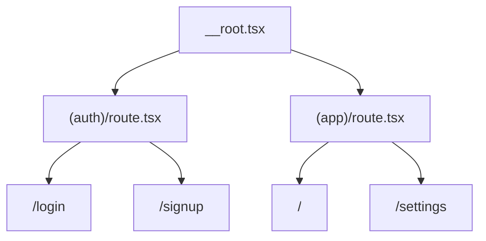

# Auth Routing

The starter ships an auth route group for a local development auth flow. Auth pages stay outside the app shell, while protected app routes live under the `(app)` group.

## Current Shape

```text
src/renderer/src/routes/
|-- (auth)/
|   |-- route.tsx      # auth layout group
|   |-- login.tsx      # /login
|   `-- signup.tsx     # /signup
`-- (app)/
    |-- route.tsx      # guarded app shell layout
    |-- index.tsx      # /
    `-- settings.tsx   # /settings
```

`(auth)` and `(app)` are pathless TanStack Router groups. They add layout and guard behavior without adding URL segments.



## Auth Routes

The login and signup routes own navigation and sanitized redirect parsing. They render the reusable auth form and call the auth session hooks.

```tsx
<AuthForm
	mode="login"
	onSuccess={handleSignIn}
	isLoading={signIn.isPending}
	errorMessage={signIn.error?.message}
	returnTo={search.returnTo}
/>
```

The form keeps the standard shadcn auth shape: email, password, forgot-password affordance on login, a disabled primary **Login** or **Create account** scaffold button, and a secondary provider-style action. In the starter, the credential buttons are disabled scaffold controls, and **Continue with device account** creates the development auth session. The email/password controls are UI scaffold only; the shipped auth provider does not verify credentials or create durable accounts.

## App Route Guard

The `(app)` layout checks the auth session before rendering protected routes:

```text
(app)/route.tsx beforeLoad
  -> ensure auth session through TanStack Query
  -> redirect missing sessions to /login?returnTo=<current path>
```

This keeps the guard at the shell boundary instead of duplicating checks in every app route.

## Safe returnTo Parsing

The login and signup routes accept an optional `returnTo` search parameter. The parser runs through `getSafeRedirectUrl`:

```tsx
const searchSchema = z.object({
	returnTo: z
		.string()
		.optional()
		.transform((value) => getSafeRedirectUrl(value))
		.catch(undefined),
});
```

Only same-app relative paths are allowed. Empty values, absolute URLs, and protocol-relative URLs are discarded.

```ts
getSafeRedirectUrl("/settings"); // "/settings"
getSafeRedirectUrl("https://example.com"); // undefined
getSafeRedirectUrl("//example.com"); // undefined
```

This prevents open redirects while still letting route guards send users back to their original in-app destination.

## Why No auth/index.ts Barrel?

This repo generally imports concrete modules instead of adding barrels for one export. Auth routes import the form directly:

```tsx
import { AuthForm } from "@renderer/components/auth/auth-form";
```

Add a barrel only when the auth folder grows into a stable public component surface with multiple exports that are commonly consumed together.

## Provider Scope

Core auth uses the development auth provider documented in [Auth Session Contract](auth-session-contract.md). Provider-specific integrations such as Microsoft Entra, Google, Auth0/Okta, activation-code, or custom backend auth belong in optional recipes and client apps.
