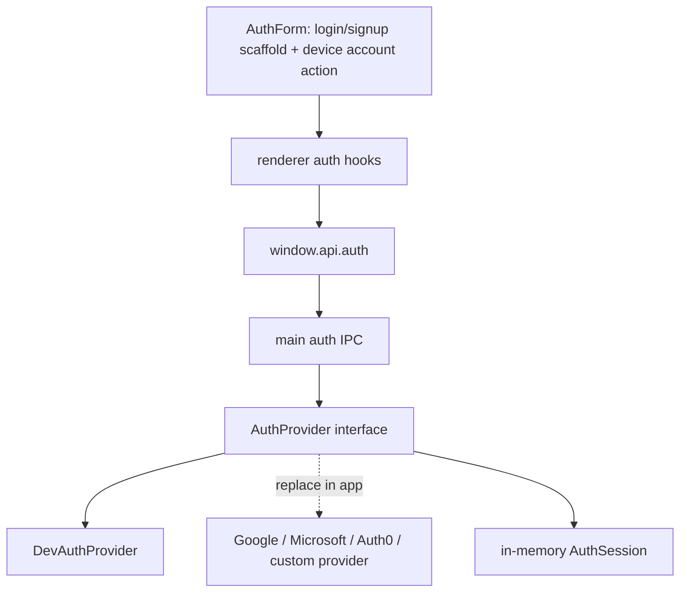

# Auth Session Contract

The starter ships a provider-neutral auth session contract without choosing Google, Microsoft, Auth0, Okta, or another identity provider in core. The default implementation is a development auth provider: the login and signup pages keep the normal shadcn email/password form shape, expose **Continue with device account** as the wired provider action, and the main process creates an in-memory app session from the current operating-system user.

Real apps can replace only the provider layer with OAuth, activation-code, backend session, local-only auth, or device/domain policy while keeping the renderer, IPC, route guards, and logout flow.

## Mental Model



The renderer only knows about safe session metadata. It does not know how identity was verified, and it never owns tokens.

## Public Contract

The preload API is intentionally narrow:

```ts
window.api.auth.getSession();
window.api.auth.signIn();
window.api.auth.signOut();
```

Use `signIn` and `signOut` for the internal contract because those names map well to identity providers and SDKs. UI can still say **Login** and **Logout**.

## Session Shape

A session is UI-safe metadata:

```ts
export type AuthSession = {
	user: {
		id: string;
		name: string;
		username?: string;
		provider: string;
	};
	issuedAt: string;
	expiresAt?: string;
};
```

The development auth provider uses `provider: "dev"`. Do not include access tokens, refresh tokens, provider cache blobs, passwords, activation secrets, or API keys in `AuthSession`.

## Provider Interface

The main process owns the provider. The current implementation uses the narrow contract below; the planned generalized contract is specified in [Auth Provider Contract](examples/auth-provider-contract.md).

```ts
export type AuthProvider = {
	getSession: () => Promise<AuthSession | null>;
	signIn: () => Promise<AuthSession>;
	signOut: () => Promise<void>;
};
```

`DevAuthProvider` behaves like this:

```text
signIn()
  -> read the current OS user in main with os.userInfo()
  -> create an in-memory AuthSession
  -> return safe session metadata

getSession()
  -> return the current in-memory session or null

signOut()
  -> clear the in-memory session
```

This is not OAuth and does not prompt for OS password, biometrics, admin permission, or consent. It is a local development/default provider that demonstrates the architecture.

## Why Development Auth?

A fake hard-coded user is easy but too toy-like. A full provider such as Google or Microsoft is too opinionated for a reusable Electron starter. Development auth sits in the middle:

- It works without external setup.
- It runs in the main process, where Electron and OS capability code belongs.
- It gives developers a real provider boundary to replace.
- It avoids storing or faking tokens.
- It keeps the starter useful for simple local/internal desktop apps.

For production authorization, apps can replace the provider with a backend, identity provider, activation flow, or domain/device policy.

## Renderer Flow

Renderer routes use TanStack Query hooks, not direct IPC calls:

```text
AuthForm login/signup
  -> useSignIn()
  -> auth.signIn mutation
  -> write session to auth query cache
  -> navigate to returnTo or /

Settings Logout
  -> useSignOut()
  -> clear auth session query
  -> navigate to /login
```

Route components own navigation. Query hooks own session state. Main owns the session source of truth.

## Route Guard Flow

The `(app)` layout protects app routes:

```text
(app)/route.tsx beforeLoad
  -> ensure auth session
  -> if missing, redirect to /login?returnTo=<current path>

(auth)/login.tsx and (auth)/signup.tsx beforeLoad
  -> if session exists, redirect to returnTo or /
```

Keep `returnTo` sanitized with `getSafeRedirectUrl` so the app never creates an open redirect.

## Secret Storage Boundary

The development auth provider does not persist secrets and does not use `safeStorage`.

Use the planned secure-storage abstraction only when a real provider stores sensitive material. See [Secure Storage](examples/secure-storage.md).

- refresh tokens
- activation secrets
- API keys
- encrypted provider cache
- device credentials

A client ID is not a secret and does not belong in `safeStorage`.

## Replacement Pattern

A production app should replace only the provider layer:

```text
DevAuthProvider -> GoogleAuthProvider
DevAuthProvider -> MicrosoftEntraAuthProvider
DevAuthProvider -> ActivationCodeAuthProvider
DevAuthProvider -> CustomBackendAuthProvider
```

The route UI, preload API, IPC contract, query hooks, route guards, and logout flow should stay the same.
