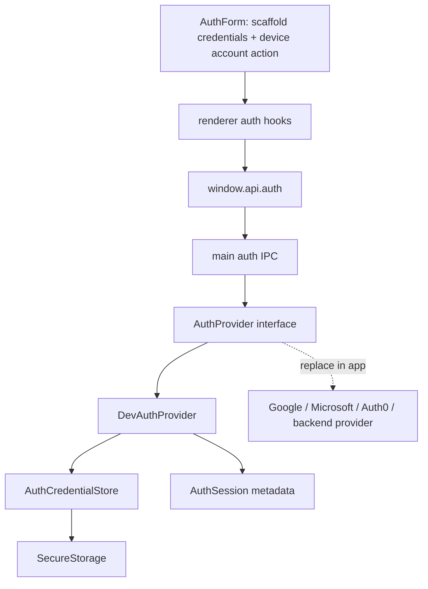

# Auth Session Contract

The starter ships a provider-neutral auth session contract without choosing Google, Microsoft, Auth0, Okta, username/password, or another identity provider in core.

The default implementation is `DevAuthProvider`. It behaves like a replaceable production provider while staying local and setup-free: the login and signup pages keep the normal shadcn email/password form shape, the credential buttons are disabled scaffolds, and **Continue with device account** signs in with the current operating-system username through the Electron main process.

Real apps can replace only the provider layer with OAuth, activation-code, backend session, local-only auth, or device/domain policy while keeping the renderer, IPC, route guards, profile display, and logout flow.

## Why Auth Is Set Up This Way

The starter is meant to save teams from writing the same auth plumbing from scratch for every Electron app. Most production auth systems share the same app-side shape even when the identity provider changes:

- a sign-in entry point
- a safe session object for UI and route guards
- a durable provider credential or cache owned outside the renderer
- a restore/refresh path on app restart
- a logout path that clears memory and provider credentials
- route guards that do not care which provider created the session

`DevAuthProvider` exists to exercise that shape without forcing this template to choose Google, Microsoft, Auth0, a backend, passwords, or activation codes. It gives a new app working routes, hooks, IPC, secure storage, session restore, profile display, and logout on day one. When a real provider is needed, the app should replace the main-process provider implementation first, then adjust only the provider-specific UI/configuration that the product requires.

```text
starter default
  DevAuthProvider + device strategy

client app
  MicrosoftEntraAuthProvider / GoogleAuthProvider / BackendAuthProvider
  same route guards
  same window.api.auth shape
  same renderer hooks
  same Settings logout flow
```

This is why the email/password fields are present but disabled in the starter UI: they show where a credentials provider would connect, while the only shipped working action remains provider-neutral and setup-free.

## Mental Model



The renderer only knows about safe session metadata. It does not know how identity was verified, and it never owns credentials, tokens, provider cache blobs, or secrets.

## Public Contract

The preload API is intentionally narrow:

```ts
window.api.auth.getSession(): Promise<AuthSession | null>;
window.api.auth.signIn({ strategy: "device" }): Promise<AuthSession>;
window.api.auth.refreshSession(): Promise<AuthSession | null>;
window.api.auth.signOut(): Promise<void>;
```

Use `signIn` and `signOut` for the internal contract because those names map well to identity providers and SDKs. UI can still say **Login**, **Create account**, and **Logout**.

## Session Shape

A session is UI-safe metadata:

```ts
export type AuthSession = {
	user: {
		id: string;
		name: string;
		username?: string;
		provider: string;
	};
	issuedAt: string;
	expiresAt?: string;
};
```

The development auth provider uses `provider: "dev"`. Do not include access tokens, refresh tokens, provider cache blobs, passwords, activation secrets, or API keys in `AuthSession`.

## Provider Interface

The main process owns the provider:

```ts
export type AuthSignInRequest = {
	strategy: "device";
};

export type AuthProvider = {
	id: string;
	getSession: () => Promise<AuthSession | null>;
	signIn: (request: AuthSignInRequest) => Promise<AuthSession>;
	refreshSession: () => Promise<AuthSession | null>;
	signOut: () => Promise<void>;
};
```

`AuthSignInRequest` is validated at the IPC boundary with Zod before a provider sees it.

## DevAuthProvider Lifecycle

`DevAuthProvider` is local-only, but it exercises the same lifecycle a real provider needs:

```text
signIn({ strategy: "device" })
  -> read the current OS user in main with os.userInfo()
  -> validate that a username exists
  -> store provider credential metadata through AuthCredentialStore
  -> create an in-memory AuthSession
  -> return safe session metadata

getSession()
  -> return the in-memory session when available
  -> otherwise restore from secure credential metadata

refreshSession()
  -> clear memory
  -> re-read and validate stored credential metadata
  -> return a fresh AuthSession or null

signOut()
  -> clear memory
  -> delete provider credential metadata
```

Restore succeeds only when the stored username still matches the current OS username. Missing, corrupted, invalid, or mismatched credential state resolves to `null` and clears stored auth data.

This is not OAuth and does not prompt for OS password, biometrics, admin permission, or consent. It is a local development/default provider that demonstrates the architecture.

## Secure Storage Boundary

`DevAuthProvider` stores durable credential metadata through `AuthCredentialStore`, which uses the main-process secure storage module documented in [Secure Storage](secure-storage.md). The renderer never receives the stored credential value.

Use secure storage for provider-owned sensitive material such as refresh tokens, provider cache blobs, activation secrets, API keys, or device-bound credentials. A public OAuth client ID is not a secret and does not belong in secure storage.

## Renderer Flow

Renderer routes use TanStack Query hooks, not direct IPC calls:

```text
AuthForm login/signup
  -> useSignIn()
  -> window.api.auth.signIn({ strategy: "device" })
  -> write session to auth query cache
  -> navigate to returnTo or /

Settings Logout
  -> useSignOut()
  -> window.api.auth.signOut()
  -> clear auth session query
  -> navigate to /login
```

Route components own navigation. Query hooks own session state. Main owns the session source of truth.

## Route Guard Flow

The `(app)` layout protects app routes:

```text
(app)/route.tsx beforeLoad
  -> ensure auth session through TanStack Query
  -> if missing, redirect to /login?returnTo=<current path>

(auth)/login.tsx and (auth)/signup.tsx beforeLoad
  -> if session exists, redirect to returnTo or /
```

Keep `returnTo` sanitized with `getSafeRedirectUrl` so the app never creates an open redirect.

## Logging Boundary

Auth IPC logs lifecycle events with provider id and sign-in strategy only:

```text
Auth session created
Auth session refreshed
Auth session cleared
Auth session creation failed
```

Never log usernames when they are not needed, raw credential metadata, tokens, passwords, activation codes, or provider cache payloads.

## Replacement Pattern

A production app should replace only the provider layer:

```text
DevAuthProvider -> GoogleAuthProvider
DevAuthProvider -> MicrosoftEntraAuthProvider
DevAuthProvider -> ActivationCodeAuthProvider
DevAuthProvider -> CustomBackendAuthProvider
```

The route UI, preload API, IPC contract, query hooks, route guards, profile display, and logout flow should stay the same. Provider-specific OAuth browser flows, custom protocols, backend APIs, token refresh, and account policy belong inside the replacement provider and optional app configuration.
