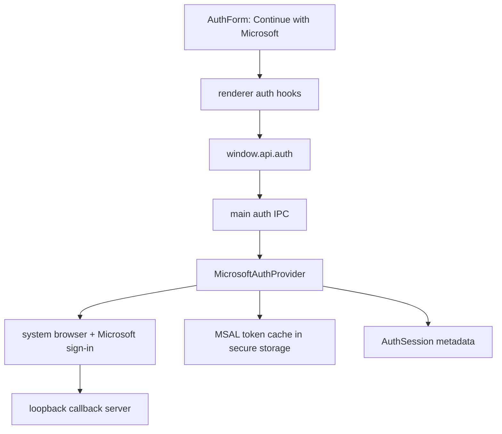

# Auth Session Contract

This branch ships a Microsoft-only runtime auth flow on top of the same provider boundary used by the starter. The renderer still talks to `window.api.auth`, TanStack Query hooks, route guards, and Settings logout/profile UI. The main process owns Microsoft auth, token cache storage, and session restoration.

The installed provider is `MicrosoftAuthProvider`. It uses MSAL, authorization code with PKCE, a loopback callback server, Electron `safeStorage`-backed secure storage, and a curated `AuthSession` for the renderer. Tokens, raw claims, MSAL cache data, ID tokens, access tokens, refresh tokens, and full account objects never cross preload.

## Why Auth Is Set Up This Way

Most desktop auth implementations need the same app-side lifecycle even when the provider changes:

- a sign-in entry point
- a safe session object for UI and route guards
- provider credentials or token cache owned outside the renderer
- restore and refresh on app restart
- logout that clears memory and durable provider state
- route guards that do not know provider internals

Microsoft is the only installed auth provider on this branch, but the renderer remains stable enough that a later Google, Auth0, backend, activation-code, or domain-gate provider can replace the main-process implementation without rewriting protected routes.

## Mental Model



The renderer knows who is signed in. It does not know how tokens are acquired or where provider cache material is stored.

## Public Contract

The preload API is intentionally narrow:

```ts
window.api.auth.getSession(): Promise<AuthSession | null>;
window.api.auth.signIn({ strategy: "microsoft" }): Promise<AuthSession>;
window.api.auth.refreshSession(): Promise<AuthSession | null>;
window.api.auth.signOut(): Promise<void>;
```

`signIn` and `signOut` are internal contract names because they map cleanly to provider SDKs. The UI can still say **Login**, **Sign up**, and **Logout**.

## Session Shape

A session is UI-safe metadata:

```ts
export type AuthUser = {
	id: string;
	name: string;
	displayName: string;
	email?: string;
	username?: string;
	tenantId?: string;
	provider: "microsoft";
	providerLabel: "Microsoft 365";
};

export type AuthSession = {
	user: AuthUser;
	issuedAt: string;
	expiresAt?: string;
};
```

`email` and `username` come from MSAL `account.username` when Microsoft returns it. `tenantId` comes from the account tenant when available, otherwise from typed config. Do not add tokens, cache blobs, raw claims, passwords, activation secrets, or API keys to `AuthSession`.

## Provider Interface

The main process owns the provider:

```ts
export type AuthSignInRequest = {
	strategy: "microsoft";
};

export type AuthProvider = {
	id: string;
	getSession: () => Promise<AuthSession | null>;
	signIn: (request: AuthSignInRequest) => Promise<AuthSession>;
	refreshSession: () => Promise<AuthSession | null>;
	signOut: () => Promise<void>;
};
```

`AuthSignInRequest` is validated at the IPC boundary with Zod before the provider sees it.

## Microsoft Provider Lifecycle

```text
signIn({ strategy: "microsoft" })
  -> create PKCE verifier/challenge and state
  -> start loopback callback listener
  -> open the system browser to Microsoft
  -> exchange authorization code with MSAL
  -> persist MSAL token cache through secure storage
  -> store minimal provider credential metadata
  -> return safe AuthSession metadata

getSession()
  -> return the in-memory session when valid
  -> otherwise hydrate MSAL token cache and acquire silently

refreshSession()
  -> validate/renew through MSAL silent token acquisition
  -> return safe AuthSession metadata or null

signOut()
  -> clear memory
  -> delete MSAL token cache
  -> delete provider credential metadata
```

Browser launch failures abort the pending callback listener so sign-in does not hang. Missing, corrupted, tenant-mismatched, or invalid stored state resolves to `null` and clears stored auth state.

## Secure Storage Boundary

`MicrosoftAuthProvider` uses the main-process secure storage modules documented in [Secure Storage](secure-storage.md). The renderer never receives stored credential values or MSAL cache content.

Use secure storage for provider-owned sensitive material such as refresh tokens, provider cache blobs, activation secrets, API keys, or device-bound credentials. A public OAuth client ID is not a secret and belongs in typed config, not secure storage.

## Renderer Flow

Renderer routes use TanStack Query hooks, not direct IPC calls:

```text
AuthForm login/signup
  -> useSignIn({ strategy: "microsoft" })
  -> window.api.auth.signIn({ strategy: "microsoft" })
  -> write session to auth query cache
  -> navigate to returnTo or /

Settings Logout
  -> useSignOut()
  -> window.api.auth.signOut()
  -> clear auth session query
  -> navigate to /login
```

Route components own navigation. Query hooks own renderer session state. Main owns the session source of truth.

## Route Guard Flow

The `(app)` layout protects app routes:

```text
(app)/route.tsx beforeLoad
  -> ensure auth session through TanStack Query
  -> if missing, redirect to /login?returnTo=<current path>

(auth)/login.tsx and (auth)/signup.tsx beforeLoad
  -> if session exists, redirect to returnTo or /
```

Keep `returnTo` sanitized with `getSafeRedirectUrl` so the app never creates an open redirect.

## Logging Boundary

Auth IPC logs lifecycle events with provider id and sign-in strategy only:

```text
Auth session created
Auth session refreshed
Auth session cleared
Auth session creation failed
```

Never log usernames unless needed for a supportable product requirement. Never log raw credential metadata, tokens, passwords, activation codes, or provider cache payloads.

## Replacement Pattern

A later provider should replace the main-process provider layer first:

```text
MicrosoftAuthProvider -> GoogleAuthProvider
MicrosoftAuthProvider -> Auth0Provider
MicrosoftAuthProvider -> ActivationCodeAuthProvider
MicrosoftAuthProvider -> CustomBackendAuthProvider
```

Keep the preload API, IPC channels, query hooks, route guards, profile display, and logout behavior stable where possible. Provider-specific browser flows, custom protocols, backend calls, token refresh, and account policy belong inside the replacement provider and typed config.
