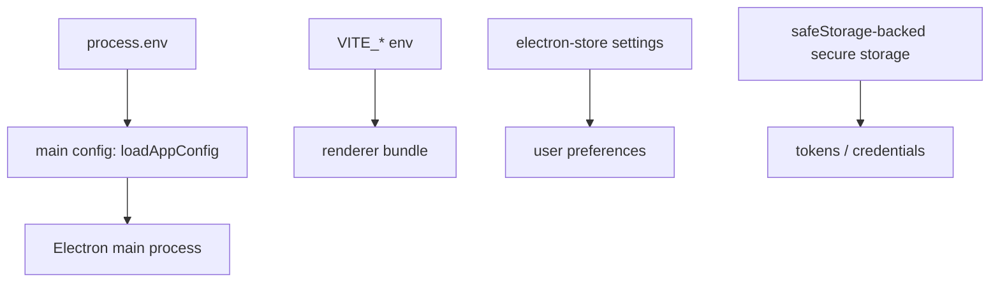

# Config Boundaries

The starter separates configuration by trust boundary. This keeps deployment values, public renderer values, user preferences, and secrets from drifting into the wrong process.

## Mental Model



Use the narrowest place that matches the value lifetime and sensitivity.

## Main-Process Runtime Config

Main-process config lives in `src/main/config/app-config.ts` and is validated with Zod before the app starts.

Supported values:

```env
APP_USER_MODEL_ID=com.electron.react-starter-kit
APP_LOG_LEVEL=info
ELECTRON_RENDERER_URL=http://localhost:5173
```

Use main config for Electron/runtime/deployment values such as app user model id, log level, provider endpoints used only by main, update feed configuration, and development-only renderer URL plumbing.

`ELECTRON_RENDERER_URL` is still validated by the existing security helper before it is loaded. In development, it must be HTTP on a loopback host.

## Renderer Public Env

Renderer env values must be prefixed with `VITE_` and are typed in `src/renderer/src/env.d.ts`.

```env
VITE_APP_NAME="Electron React Starter Kit"
VITE_SUPPORT_URL="https://github.com/AchuAshwath/electron-react-starter-kit/issues"
```

Every `VITE_*` value is bundled into renderer code. Treat it as public. Do not put tokens, client secrets, refresh tokens, API keys, activation codes, or private endpoints here.

## Settings Versus Secure Storage

Use settings for normal user preferences:

- theme
- window bounds
- desktop notification preference

Use secure storage for sensitive runtime material:

- OAuth refresh tokens
- provider cache blobs
- activation secrets
- API keys entered by a user or administrator
- device-bound credentials

A public OAuth client ID is configuration, not a secret. A client secret is not safe in a desktop app bundle and should not be stored in renderer env.

## Add A New Config Value

1. Add the env variable to `.env.example` with a comment that says whether it is main-only or renderer-public.
2. For main-only values, add parsing and validation in `loadAppConfig`.
3. For renderer-public values, add the key to `ImportMetaEnv` in `src/renderer/src/env.d.ts`.
4. Document where the value belongs if it affects a core feature.
5. Add a config test when the value has validation or defaults.
