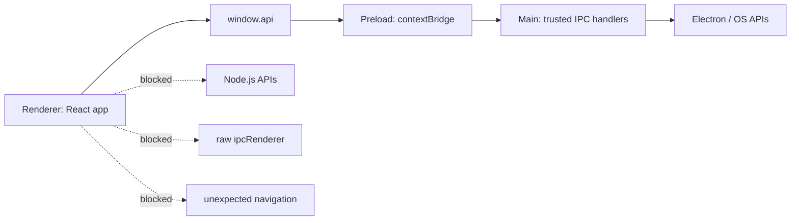
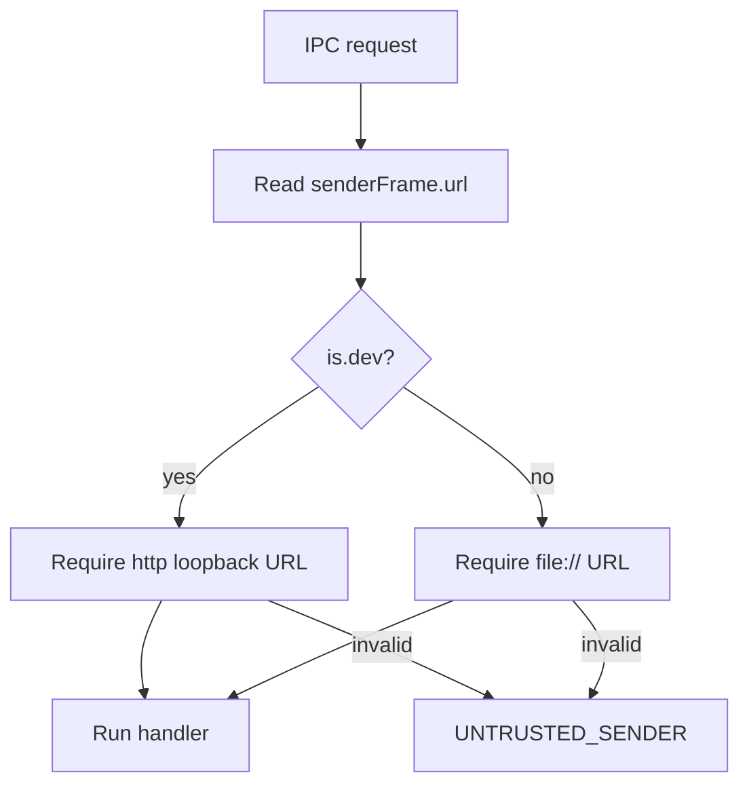

# Electron Security

The starter treats Electron as a privileged host and the renderer as an untrusted web surface. Main and preload own capabilities; renderer code receives only the typed APIs it needs.

## Security Boundary Diagram



## BrowserWindow Defaults

`getSecureWebPreferences` returns secure defaults:

```ts
export function getSecureWebPreferences(preloadPath: string): WebPreferences {
	return {
		preload: preloadPath,
		contextIsolation: true,
		nodeIntegration: false,
		nodeIntegrationInWorker: false,
		nodeIntegrationInSubFrames: false,
		sandbox: true,
		webSecurity: true,
		allowRunningInsecureContent: false,
		experimentalFeatures: false,
	};
}
```

These settings mean renderer code cannot use Node.js APIs and must go through preload for app capabilities.

## Renderer Loading Policy

Development allows only loopback Vite URLs:

```ts
export function isAllowedDevRendererUrl(url: URL): boolean {
	return url.protocol === "http:" && loopbackHostnames.has(url.hostname);
}
```

Production loads the bundled renderer from `file://`. Any future custom protocol should be evaluated as a distribution-hardening decision, not casually added during feature work.

## Content Security Policy

`src/renderer/index.html` defines the renderer CSP. Keep it restrictive:

- Start from `default-src 'self'`.
- Add narrow source directives only for a specific feature.
- Do not add broad sources such as `*` or unsafe script policies.
- Document any new source in this guide or in the feature PR.

## Navigation And Window Policy

The security module blocks unexpected app navigation:

```ts
window.webContents.on("will-navigate", (event) => {
	event.preventDefault();
});
```

It also denies renderer-created windows and only opens approved external protocols:

```ts
window.webContents.setWindowOpenHandler((details) => {
	if (isAllowedExternalUrl(details.url)) {
		shell.openExternal(details.url);
	}

	return { action: "deny" };
});
```

Allowed external protocols are currently `https:` and `mailto:`.

## Permission Policy

Runtime permission requests are denied by default:

```ts
session.defaultSession.setPermissionRequestHandler(
	(_webContents, _permission, callback) => {
		callback(false);
	},
);
```

When a feature needs a permission, add a feature-owned flow that explains, stores, and validates the behavior. Notifications are the current example.

## IPC Sender Trust

Every shared IPC handler calls `assertTrustedIpcSender`. Development accepts loopback renderer URLs; production accepts `file://` app frames.



## Feature Security Checklist

Before adding a feature that touches platform APIs:

1. Keep the Electron API call in main or preload.
2. Expose the smallest possible `window.api` method.
3. Validate renderer input with Zod.
4. Deny or sanitize paths, URLs, and user-provided strings before platform use.
5. Avoid logging paths, secrets, file contents, and raw payloads.
6. Add tests for denial behavior when practical.

## References

- Electron security checklist: https://www.electronjs.org/docs/latest/tutorial/security
- Electron context isolation: https://www.electronjs.org/docs/latest/tutorial/context-isolation
