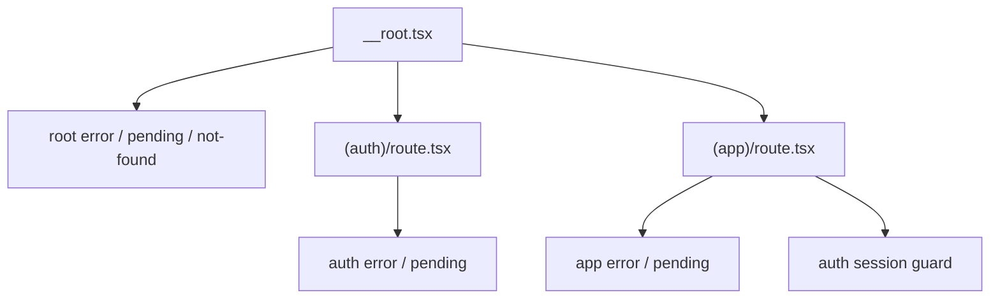

# Error Boundaries

The starter ships route-level recovery UI for TanStack Router. The goal is to keep auth checks, app-shell loaders, and unexpected route failures from collapsing into a blank renderer.

## Current Wiring



The fallback components live in:

```text
src/renderer/src/components/route-fallbacks.tsx
src/renderer/src/components/route-fallbacks.test.tsx
```

The root route wires global fallbacks:

```tsx
export const Route = createRootRouteWithContext<RouterContext>()({
	component: RootLayout,
	errorComponent: RouteErrorView,
	notFoundComponent: RouteNotFoundView,
	pendingComponent: RoutePendingView,
});
```

The auth and app layout groups provide more specific messages:

```tsx
export const Route = createFileRoute("/(app)")({
	beforeLoad: async ({ context, location }) => {
		const session = await context.queryClient.ensureQueryData(
			authQueries.session(),
		);

		if (!session) {
			throw redirect({
				to: "/login",
				search: { returnTo: location.href },
			});
		}
	},
	errorComponent: AppRouteErrorView,
	pendingComponent: AppRoutePendingView,
	component: AppLayout,
});
```

## Redirects Are Not Errors

TanStack Router redirects thrown from `beforeLoad` are normal control flow. A missing auth session should redirect to `/login`; it should not render an error boundary.

Real failures, such as an auth IPC failure, query failure, or route component crash, can render the nearest route error component.

```text
no session        -> redirect to /login?returnTo=...
auth IPC failure  -> auth/app route error fallback
unknown route     -> root not-found fallback
loading guard     -> route pending fallback
```

## User Experience

`RouteErrorView` shows:

- a short user-friendly failure message
- a retry button that calls TanStack Router's `reset`
- a Home link
- collapsible error details

Error details are visible by default in development and hidden by default in production.

## Add A Route-Specific Error View

Use a route-specific error component when the recovery message should be more precise than the app-level fallback:

```tsx
export const Route = createFileRoute("/(app)/reports")({
	component: ReportsRoute,
	errorComponent: ReportsError,
});

function ReportsError(props: ErrorComponentProps): React.JSX.Element {
	return (
		<RouteErrorView
			{...props}
			title="Could not load reports"
			description="The reports view failed while loading. Retry the route or return home."
		/>
	);
}
```

Prefer the shared fallback components unless a route needs a domain-specific message.

## Testing

Component tests should cover the shared fallback behavior:

- renders safe fallback copy
- toggles error details
- calls `reset` from the retry button
- renders pending status with `role="status"`
- renders the not-found view

Keep these tests beside the component so route reliability changes are easy to review.
