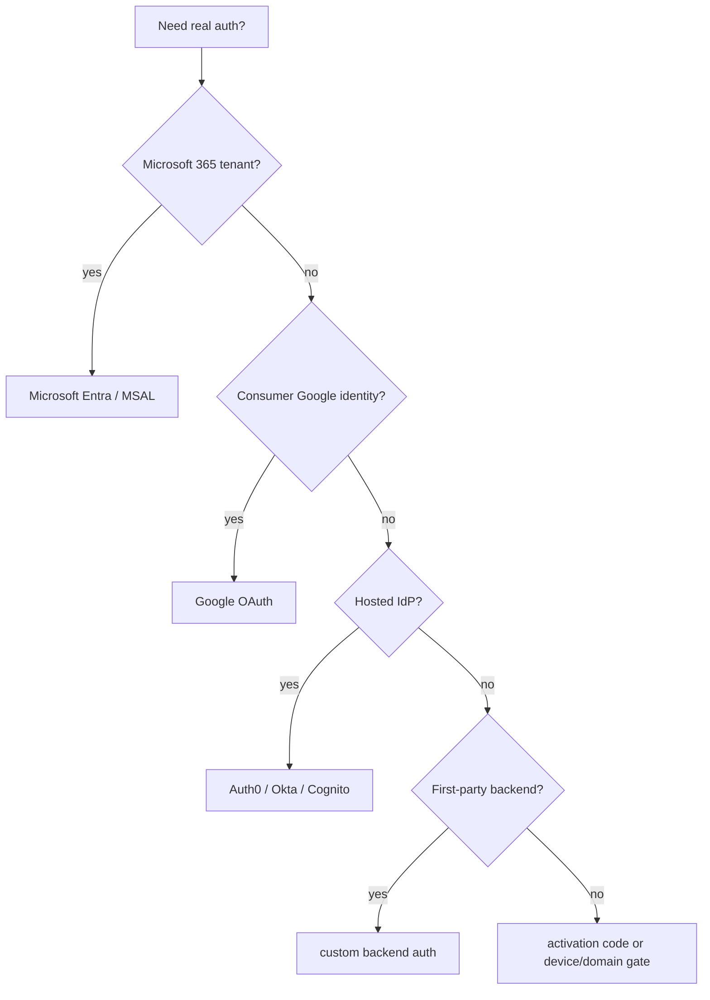

# Auth Provider Recipes

This recipe index explains common ways to replace `DevAuthProvider` in a client app. These are not installed starter behavior. The starter core keeps one provider-neutral auth contract and a local development provider so client apps can choose the identity model that fits their infrastructure.

## Stable Starter Surface

Most provider swaps should keep these pieces stable:

- `window.api.auth`
- auth IPC channels
- TanStack Query auth hooks
- `(auth)` login/signup routes
- `(app)` route guard
- Settings profile/logout UI
- `AuthSession` as safe renderer metadata

Provider-specific work should live in the main-process provider, config, secure storage usage, and optional provider-specific UI copy.

## Provider Decision Map

## Microsoft Entra / MSAL

Use this when the client already has Microsoft 365 or Entra ID.

Typical changes:

- create an Entra app registration for a public desktop client
- implement a main-process `MicrosoftEntraAuthProvider`
- use authorization code with PKCE through a native-app-safe browser flow
- store MSAL/provider cache through the provider SDK storage or the starter secure storage boundary
- map account metadata into `AuthSession`

Keep client secrets out of the desktop app. Public desktop clients cannot safely protect a client secret.

## Google OAuth

Use this when the app intentionally chooses Google identity.

Typical changes:

- create a Google OAuth desktop/public client
- implement a main-process `GoogleAuthProvider`
- use authorization code with PKCE and a system-browser flow
- handle redirect through a loopback server or custom protocol according to the chosen desktop pattern
- store refresh/provider cache material in main-process secure storage
- map Google profile metadata into `AuthSession`

Do not treat the existing **Continue with device account** action as Google auth. It is the starter's local development provider action.

## Auth0 / Okta / Cognito

Use this when the app relies on a hosted identity platform.

Typical changes:

- configure the IdP application as a public/native client where appropriate
- implement a provider that owns OAuth/OIDC redirects, token exchange, refresh, and logout
- store refresh tokens or provider cache in main-process secure storage or the IdP SDK's secure cache
- keep organization/tenant/domain configuration in typed config, not renderer secrets

Hosted providers often differ in logout, refresh, and organization/tenant behavior. Keep those differences inside the provider implementation.

## Custom Backend Auth

Use this when a first-party API owns user identity and sessions.

Typical changes:

- implement a provider that exchanges credentials, magic links, SSO assertions, or device codes with the backend
- store backend refresh/session credentials in secure storage
- return only safe user/session metadata to the renderer
- keep API base URLs in typed config
- centralize network and error handling in main-process services

If the backend uses cookies, decide whether the app relies on Electron session cookies or explicit token storage. Do not let renderer components own long-lived credentials.

## Activation-Code Auth

Use this for licensed desktop apps where users enter a code or device token issued by a vendor/backend.

Typical changes:

- add an activation-code sign-in strategy
- validate the code against the backend in main
- store activation secret or device credential in secure storage
- refresh/validate the activation state on app start
- clear activation state on logout/deactivation

Activation codes are secrets after redemption. Do not persist them in settings or renderer state.

## OS / Domain / Device Gate

Use this for managed internal tools where access is based on the device, OS user, domain, or enterprise network policy.

Typical changes:

- replace `DevAuthProvider` with a stricter provider that validates OS/domain/device state
- verify policy in main process
- store only the minimum credential or policy metadata needed to restore the session
- make failure messages safe and non-enumerating

This is closer to access gating than identity federation. Document the policy clearly for the client app.

## What Stays Out Of Core

The starter should not pick a default real identity provider. Do not add Google, Microsoft, Auth0, backend auth, activation-code auth, or domain policy to core unless the product itself requires it.

Use provider recipes to guide client apps while keeping the starter reusable.

## Implementation Checklist

1. Add provider-specific typed config.
2. Extend `AuthSignInRequest` only for the strategies the provider supports.
3. Validate sign-in input with Zod at the IPC boundary.
4. Implement provider lifecycle in main: sign in, get session, refresh, sign out.
5. Store tokens/provider cache only through secure storage or the provider SDK's secure cache.
6. Return safe `AuthSession` metadata to renderer hooks.
7. Keep routes, guards, logout, and profile display provider-neutral.
8. Add provider tests for restore, refresh, sign-out, unsupported strategy, and secret handling.

## Related Docs

- [Auth Session Contract](../auth-session-contract.md)
- [Auth Provider Contract Notes](auth-provider-contract.md)
- [Secure Storage](../secure-storage.md)
- [Config Boundaries](../config.md)
