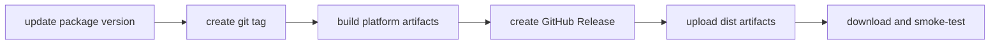

# GitHub Releases Distribution

This recipe shows how to distribute packaged artifacts through GitHub Releases. It does not enable runtime auto-update and it does not require GitHub Releases for every app.

Use this when a project wants a simple release channel where installers and packages are attached to a GitHub release page. This repository includes a GitHub Actions workflow for the common path, and this recipe also keeps the manual commands visible for teams that prefer local or controlled builds.

## What GitHub Releases Does

GitHub Releases hosts release notes and downloadable assets. For this starter, those assets are the files produced by `electron-builder` in `dist/`.



GitHub Releases is replaceable. Client apps may instead use a private portal, S3/R2, Azure Blob Storage, Intune, SCCM, Jamf, or another managed deployment channel.

## Before A Release

Confirm the client app has replaced starter metadata:

- app name and version in `package.json`
- `appId`, `productName`, executable name, maintainer, and category in `electron-builder.yml`
- app icons and platform resources under `build/`
- release notes that match the product and audience

For public distribution, also decide whether each platform build is signed and notarized. Unsigned artifacts can be useful for internal testing, but they should be labeled clearly.

## Build Artifacts

Run the build for each target platform:

```powershell
pnpm build:win
pnpm build:mac
pnpm build:linux
```

The current starter targets produce release candidates similar to:

```text
Windows: dist/*-setup.exe
macOS:   dist/*.dmg
Linux:   dist/*.AppImage, dist/*.deb, dist/*.snap
```

Exact names depend on version, platform, architecture, and `electron-builder.yml` artifact templates.

## Included GitHub Actions Flow

The starter includes [`.github/workflows/release.yml`](../../.github/workflows/release.yml). It runs on pushed `v*` tags or from **Actions > Release > Run workflow** with an existing tag.

What the workflow does:

1. Builds Windows artifacts on `windows-latest` with `pnpm build:win`.
2. Builds macOS artifacts on `macos-latest` with `pnpm build:mac`.
3. Builds Linux artifacts on `ubuntu-latest` with `pnpm build:linux`.
4. Verifies the tag version matches `package.json`.
5. Uploads build outputs as short-lived workflow artifacts.
6. Creates a draft GitHub Release when one does not already exist for the tag.
7. Uploads the packaged installers/packages with `gh release upload --clobber`.
8. Refuses to replace assets on an already-published release.

The workflow intentionally creates new releases as drafts. A human should still review artifacts, signing/notarization status, release notes, and smoke-test results before publishing.

To use the workflow from a tag push:

```powershell
git tag v1.0.0
git push origin v1.0.0
```

To run it manually, create and push the tag first, then use the workflow dispatch input with that same tag. The workflow checks out that tag for verification and platform builds, verifies that the tag matches `package.json`, and refuses to replace assets on an already-published release.

## Manual GitHub Release Flow

1. Update the package version.
2. Commit the version change.
3. Create and push a tag.
4. Build artifacts on the appropriate platform runners, local machines, or the included release workflow.
5. Create a draft GitHub Release.
6. Upload artifacts.
7. Download the release assets and smoke-test installation.
8. Publish the release when ready.

Example commands:

```powershell
git tag v1.0.0
git push origin v1.0.0

gh release create v1.0.0 --draft --title "v1.0.0" --notes "Release notes for v1.0.0"
```

Upload artifacts after builds finish:

```powershell
gh release upload v1.0.0 "dist/*-setup.exe" --clobber
gh release upload v1.0.0 "dist/*.dmg" --clobber
gh release upload v1.0.0 "dist/*.AppImage" "dist/*.deb" "dist/*.snap" --clobber
```

The GitHub CLI also supports creating a release and uploading assets in one command:

```powershell
gh release create v1.0.0 "dist/<artifact>" --draft --title "v1.0.0"
```

Use explicit file names in final release scripts when possible. Wildcards are convenient locally, but exact artifacts reduce accidental uploads.

## What To Attach

Attach installer/package artifacts that users should download:

- Windows NSIS setup `.exe`
- macOS `.dmg`
- Linux `.AppImage`, `.deb`, and `.snap` when those targets are supported

Do not attach intermediate build folders, source maps, local logs, `.env` files, signing credentials, or caches.

If auto-update is later enabled, update metadata files generated by `electron-builder` may also need to be published according to the chosen provider. That is separate from this manual distribution recipe.

## Smoke-Test Checklist

After uploading, download from the GitHub Release page and verify:

- installer launches or package opens on the target OS
- app starts from a clean install
- login/session flow works
- settings persist after restart
- file dialog and drag/drop behavior works
- native notifications behave as expected when enabled
- version shown by the app matches the release tag

## References

- GitHub CLI release create: https://cli.github.com/manual/gh_release_create
- GitHub CLI release upload: https://cli.github.com/manual/gh_release_upload
- electron-builder multi-platform build: https://www.electron.build/multi-platform-build
