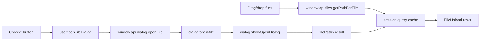

# File Dialogs And Upload

The starter includes a native file selection demo. It proves the safe Electron file-access pattern without committing the starter to durable file storage.

## Flow Diagram



## Core Files

```text
src/main/dialog/dialog.channels.ts
src/main/dialog/dialog.types.ts
src/main/dialog/dialog.ipc.ts
src/preload/index.ts
src/renderer/src/core/dialog/dialog.hooks.ts
src/renderer/src/components/ui/file-upload.tsx
src/renderer/src/routes/(app)/index.tsx
```

## Native Dialog Pattern

The main process owns native dialogs:

```ts
registerIpcHandler({
	channel: dialogIpcChannels.openFile,
	input: openFileDialogInputSchema.optional(),
	handler: (input) => dialog.showOpenDialog(input ?? {}),
});
```

Preload exposes a narrow API:

```ts
dialog: {
	openFile: (input?: OpenFileDialogInput): Promise<OpenFileDialogResult> =>
		ipcRenderer.invoke(dialogIpcChannels.openFile, input),
},
```

Renderer hooks call preload:

```ts
export function useOpenFileDialog() {
	return useMutation({
		mutationFn: (input?: OpenFileDialogInput) =>
			window.api.dialog.openFile(input),
	});
}
```

## Drag And Drop Pattern

Browser drag/drop produces `File` objects. The renderer asks preload to resolve paths:

```ts
function addDroppedFiles(files: File[]): void {
	const filePaths = files
		.map((file) => window.api.files.getPathForFile(file))
		.filter((path) => path.length > 0);

	addSelectedFilePaths(filePaths);
}
```

Do not import Electron or call `webUtils` directly in renderer components.

## Session State

Selected paths are session-only state. They live in TanStack Query cache so they survive route navigation but not app restart.

```text
selected files
  -> query cache
  -> UI rows
  -> cleared on app restart
```

Durable imports are product-specific. See [examples/imported-file-workflow.md](examples/imported-file-workflow.md) for an optional app-owned storage recipe.

## Add A File Dialog Use Case

Example: ask for a CSV file.

```ts
const result = await openFileDialog.mutateAsync({
	title: "Choose CSV file",
	buttonLabel: "Choose",
	multiple: false,
	filters: [{ name: "CSV", extensions: ["csv"] }],
});

if (!result.canceled && result.filePaths[0]) {
	setSelectedFilePaths(result.filePaths);
}
```

## FileUpload Component Pattern

Use `FileUpload` when a route needs consistent upload UI:

```tsx
<FileUpload
	multiple
	maxFiles={maxFiles}
	selectedPaths={selectedFilePaths}
	onSelectedPathsChange={setSelectedFilePaths}
	onFilesSelected={addDroppedFiles}
	onChoose={chooseFile}
	isChoosing={openFileDialog.isPending}
	description="Drop files here or choose them with the native dialog."
/>
```

## Rules Of Thumb

- Use native dialogs for trusted file paths.
- Keep durable file storage out of the starter core.
- Do not persist selected paths unless the app has a clear workflow for missing files.
- Never log full user file contents.
- Treat dropped browser `File` objects as renderer input that needs a preload bridge.
