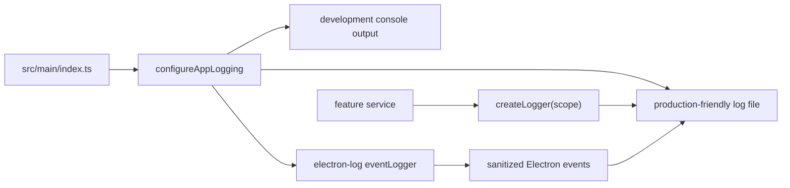

# Logging

Logging is configured in the main process with `electron-log`. Logs should help diagnose production issues without collecting sensitive data.

## Flow Diagram



## Core Files

```text
src/main/logging/logger.ts
src/main/logging/logger.test.ts
src/main/index.ts
```

## Configure Early

Logging is initialized near the top of `src/main/index.ts`:

```ts
configureAppLogging({ isDev: is.dev });
```

Initialize logging before feature modules start doing meaningful work so startup failures are captured.

## Scoped Logger Pattern

Create scoped loggers in main-process modules:

```ts
import { createLogger } from "../logging/logger";

const settingsLogger = createLogger("settings");

settingsLogger.info("Theme preference changed", {
	preference,
	resolvedTheme: themeState.resolvedTheme,
});
```

Use stable event names and small metadata objects.

## What To Log

Good log fields:

- app lifecycle events
- platform and architecture
- feature enablement state
- sanitized error category
- notification skip reason
- invalid window-bounds fallback reason
- update/check status when auto-update is added later

## What Not To Log

Never log:

- auth tokens or refresh tokens
- passwords, API keys, secrets
- full file contents or document contents
- large IPC payloads
- renderer console output in production
- sensitive user data
- full paths unless the feature explicitly requires and sanitizes them

## Electron Event Logging

The logger enables sanitized Electron event logging at warning level. This is meant for app health events such as renderer exits, child process failures, unresponsive web contents, and failed page loads.

Sanitization matters: production diagnostics should be useful without recording sensitive URLs, file paths, preload paths, or renderer output.

## Add Logs To A Feature

1. Create a scoped logger.
2. Log lifecycle or decision points, not every render or every IPC call.
3. Keep metadata bounded and non-sensitive.
4. Add or update tests when sanitization logic changes.

## Testing

`logger.test.ts` verifies configuration and sanitized event logging. When adding new event fields, update tests to prove sensitive values are omitted.
