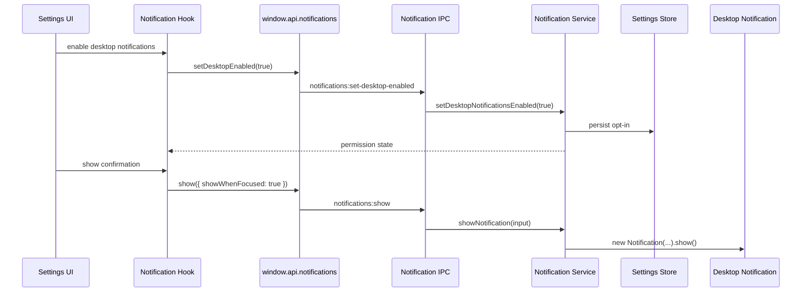

# Notifications

Native notifications are a main-process platform API. The renderer asks for notification actions through preload and uses Sonner for immediate in-app feedback.

## Flow Diagram



## Core Files

```text
src/main/notifications/notifications.channels.ts
src/main/notifications/notifications.types.ts
src/main/notifications/notifications.service.ts
src/main/notifications/notifications.ipc.ts
src/renderer/src/core/notifications/notification.hooks.ts
src/renderer/src/routes/(app)/settings.tsx
```

## Permission State

Notification state is feature-owned and persisted as a normal user preference. It is not a generic Electron permission prompt.

The service decides:

- whether notifications are supported on the current platform
- whether the user enabled desktop notifications
- whether a notification should show while the app is focused
- which renderer-safe result should be returned

## Renderer Hook Pattern

Use feature hooks instead of direct preload calls in UI:

```ts
const setDesktopNotifications = useSetDesktopNotificationsEnabled();
const showNotification = useShowNotification();

async function enableNotifications(): Promise<void> {
	const permission = await setDesktopNotifications.mutateAsync(true);

	if (permission.desktopEnabled) {
		await showNotification.mutateAsync({
			title: "Notifications are ready",
			body: "Desktop notifications are enabled.",
			showWhenFocused: true,
		});
	}
}
```

## Add A Notification To A Feature

1. Show immediate foreground feedback with Sonner.
2. Call the notification hook for OS-level delivery only when useful.
3. Keep payloads short and non-sensitive.
4. Respect focus-aware behavior unless the notification is a confirmation.

Example:

```ts
toast.success("File check complete");

showNotification.mutate({
	title: "File check complete",
	body: "3 files are ready for review.",
});
```

## What Not To Put In Notifications

Do not include:

- tokens or secrets
- full file paths
- document contents
- sensitive customer data
- unbounded error messages

## Testing

- Service tests should cover unsupported platforms, disabled preference, focused window behavior, and explicit `showWhenFocused` behavior.
- IPC tests should verify channels, input validation, and service calls.
- Hook tests should verify preload calls and mutation behavior.
