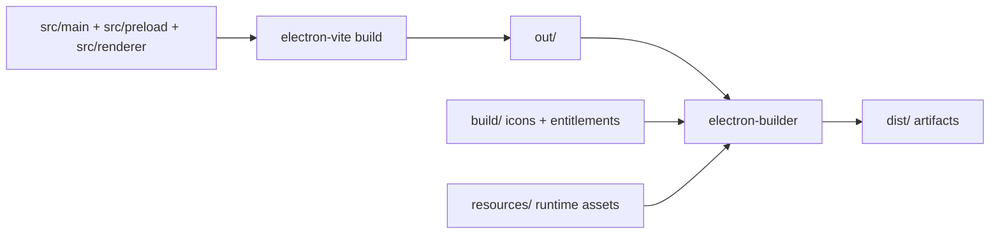

# Packaging

The starter uses `electron-vite` to compile main, preload, and renderer bundles, then `electron-builder` to create platform installers and app artifacts.

Packaging is core starter infrastructure. Distribution choices such as GitHub Releases, private portals, enterprise deployment, auto-update, signing, and notarization are app decisions documented as recipes.

## Build Pipeline



## Scripts

```bash
pnpm build         # typecheck, then compile main/preload/renderer bundles
pnpm build:unpack  # build and create an unpacked app directory for smoke testing
pnpm build:win     # build Windows artifacts from electron-builder win config
pnpm build:mac     # build macOS artifacts from electron-builder mac/dmg config
pnpm build:linux   # build Linux artifacts from electron-builder linux config
```

Use `build:unpack` when checking packaged runtime behavior locally. Use platform builds when producing release candidates.

The repository also includes [`.github/workflows/release.yml`](../.github/workflows/release.yml), which runs those platform builds on GitHub-hosted runners and uploads the resulting installers/packages to a draft GitHub Release.

## Current Artifacts

The current `electron-builder.yml` is configured for these targets:

```text
Windows  -> NSIS setup .exe
macOS    -> DMG .dmg
Linux    -> AppImage, Snap, Debian .deb
```

Expected names follow `electron-builder.yml` templates and package metadata. Examples:

```text
dist/electron-react-starter-kit-1.0.0-setup.exe
dist/electron-react-starter-kit-1.0.0.dmg
dist/electron-react-starter-kit-1.0.0.AppImage
dist/electron-react-starter-kit_1.0.0_amd64.deb
dist/electron-react-starter-kit_1.0.0_amd64.snap
```

Treat names as examples. Exact file names depend on package version, platform, architecture, target, and `electron-builder.yml` artifact templates.

## What To Customize For A Client App

Before a real release, replace starter metadata:

- `package.json`: `name`, `version`, `description`, `author`, `homepage`
- `electron-builder.yml`: `appId`, `productName`, executable name, artifact names, maintainer, category
- `build/`: platform icons, entitlements, and signing-related resources
- `resources/`: runtime assets bundled with the packaged app
- docs/release notes: product-specific install and support instructions

Keep secrets and signing credentials out of tracked config. Use CI secrets or local secure storage according to the release process.

## Cross-Platform Build Limits

Do not assume one machine can produce every production-ready artifact.

electron-builder can build multiple targets, but platform signing and native dependencies affect what is practical:

- macOS signing and notarization require macOS and Apple credentials.
- Windows signing requires a Windows code signing certificate or compatible signing setup.
- Linux packages may require Linux tooling or containerized builders.
- Native dependencies may need target-platform rebuilds.

For a serious release, build and smoke-test each platform on that platform or on a purpose-built CI runner.

## Release Candidate Checklist

1. Confirm app identity, icons, package metadata, and version.
2. Run the project verification command used by the repo, such as `pnpm ci`.
3. Build the target platform artifacts.
4. Install or run the packaged app, not only the dev server.
5. Verify login/session restore, settings persistence, native dialogs, notifications, and theme behavior in the packaged app.
6. If using the release workflow, review the draft GitHub Release assets before publishing.
7. Attach only intentional release artifacts to the chosen distribution channel.
8. Keep signing/notarization status clear in the release notes.

## Distribution Recipes

- [GitHub Releases distribution](examples/distribution-github-releases.md): manual release flow for attaching installers/packages to GitHub Releases.
- [Distribution hardening](examples/distribution-hardening.md): signing, notarization, fuses, protocol review, dependency policy, and release posture.
- [Auto-update](examples/auto-update.md): optional runtime updater architecture when an app chooses an update channel.

## References

- electron-builder: https://www.electron.build/
- electron-builder multi-platform build: https://www.electron.build/multi-platform-build
- electron-builder code signing: https://www.electron.build/code-signing
- electron-vite: https://electron-vite.org/
