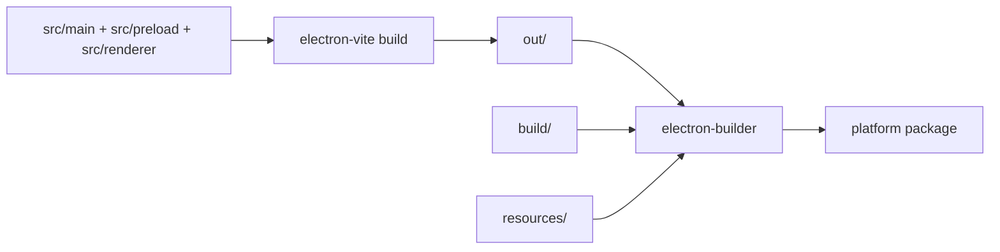

# Packaging

The starter uses `electron-builder` for distributable app builds and `electron-vite` for compiling main, preload, and renderer bundles.

## Build Pipeline



## Scripts

```bash
pnpm build         # typecheck, then electron-vite build
pnpm build:unpack  # build and create unpacked app directory
pnpm build:win     # Windows package
pnpm build:mac     # macOS package
pnpm build:linux   # Linux package
```

## Config Files

```text
electron.vite.config.ts  # main, preload, renderer build configuration
electron-builder.yml     # packaging configuration
build/                   # platform icons, entitlements, build resources
resources/               # runtime app assets
out/                     # generated build output
```

## electron-vite Responsibilities

`electron.vite.config.ts` owns:

- main-process bundling
- preload bundling
- renderer Vite config
- Tailwind plugin setup
- TanStack Router plugin setup
- renderer path aliases
- dependency externalization choices

Renderer aliases include:

```ts
resolve: {
	alias: {
		"@renderer": resolve("src/renderer/src"),
		components: resolve("src/renderer/src/components"),
		ui: resolve("src/renderer/src/components/ui"),
		lib: resolve("src/renderer/src/lib"),
	},
}
```

## electron-builder Responsibilities

`electron-builder.yml` owns packaging concerns such as app metadata, icons, resources, platform targets, and build output. Keep product-specific app names, publisher metadata, signing identity, and update publishing choices out of generic starter assumptions until the app needs them.

## Packaging Boundary

Core starter packaging includes build scripts and baseline config. These are intentionally not core behavior:

- auto-update publishing provider
- code signing identity
- enterprise deployment channel
- notarization credentials
- forced update policy

Use the optional recipes when a client app is ready:

- [Auto-update](examples/auto-update.md)
- [Distribution hardening](examples/distribution-hardening.md)

## Release Checklist For A Client App

1. Replace app name, app ID, icons, and publisher metadata.
2. Confirm production CSP and loading strategy.
3. Decide whether auto-update is used.
4. Add signing and notarization configuration when distributing externally.
5. Run `pnpm ci` and a platform package build.
6. Smoke-test the packaged app, not just dev mode.

## References

- electron-builder: https://www.electron.build/
- electron-vite: https://electron-vite.org/
