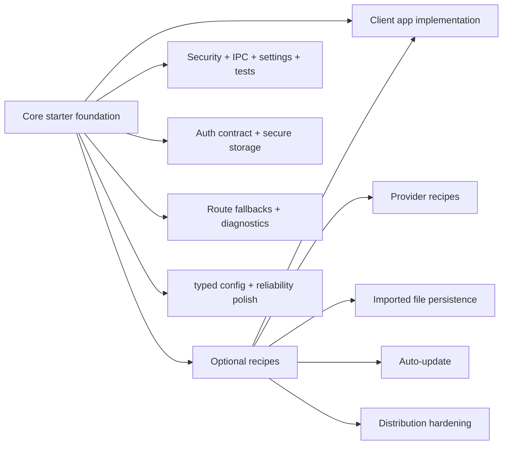

# Roadmap

The roadmap separates core starter infrastructure from optional recipes. Core items should help almost every serious Electron app. Recipes stay opt-in because they depend on product, client, provider, backend, or deployment choices.

## Roadmap Model



## Completed Core Foundation

- Electron runtime security defaults.
- Typed IPC registrar with trusted sender validation and sanitized errors.
- Preload-first renderer API.
- TanStack Router file-based routing.
- Root, auth, and app route error/pending/not-found fallbacks.
- TanStack Query factories and hooks.
- Settings persistence through `electron-store`.
- Desktop-aware theme switching.
- Native file dialog and drag/drop demo.
- Native notification preference and delivery flow.
- Window state persistence.
- Main-process logging.
- Vitest and Testing Library setup.
- electron-builder packaging scripts.
- Documentation split between core guides and optional recipes.
- Provider-neutral auth session contract with `DevAuthProvider`, typed IPC, renderer hooks, secure credential metadata, session restore/refresh, Settings profile/logout, and guarded app routes.
- Main-process secure storage module backed by Electron `safeStorage` and encrypted `electron-store` blobs.

## Core Starter Roadmap

These belong in the starter because most production Electron apps need the pattern.

### Typed config

Add documented config boundaries for:

- renderer build-time environment values
- main-process runtime configuration
- secrets that must not ship in renderer bundles
- `.env.example` and validation strategy

### Reliability polish

Extend the shipped route fallback foundation with:

- crash/reload guidance
- abnormal-exit diagnostics
- support bundle guidance for logs and app metadata
- user-facing recovery patterns for repeated failures

### Provider lifecycle examples

The core auth foundation is implemented. Future core docs or examples can show how to adapt the same contract for common provider shapes without installing a provider into the starter by default:

- OAuth authorization-code with PKCE
- backend session exchange
- credentials form submission
- activation-code flow
- device/domain policy

## Optional Recipe Roadmap

These should stay in `docs/examples/` unless a specific app chooses to implement them.

- Microsoft Entra/MSAL provider wiring for OAuth 2.0 authorization code with PKCE.
- Google OAuth, Auth0/Okta, activation-code, OS/domain gate, and custom backend auth recipes.
- Durable imported-file workflow for apps that need app-owned file storage.
- Auto-update recipe for apps that choose an update channel and publishing provider.
- Distribution hardening checklist covering code signing, Electron fuses, custom protocol evaluation, and dependency update policy.

## Decision Rule

Ask this before moving a roadmap item into core:

```text
Would almost every serious Electron app want this exact behavior?
```

If yes, it belongs in the core starter. If no, document it as an example or recipe.
