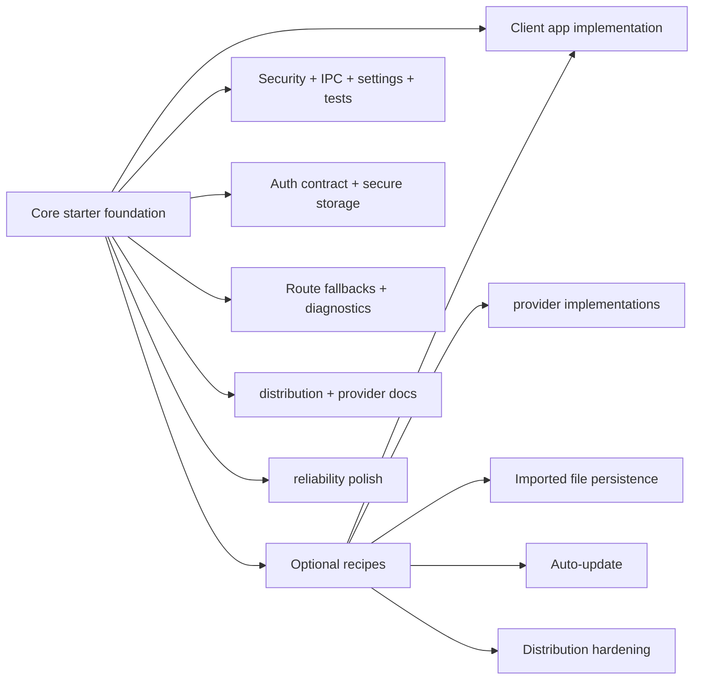

# Roadmap

The roadmap separates core starter infrastructure from optional recipes. Core items should help almost every serious Electron app. Recipes stay opt-in because they depend on product, client, provider, backend, or deployment choices.

## Roadmap Model



## Completed Core Foundation

- Electron runtime security defaults.
- Typed IPC registrar with trusted sender validation and sanitized errors.
- Preload-first renderer API.
- TanStack Router file-based routing.
- Root, auth, and app route error/pending/not-found fallbacks.
- TanStack Query factories and hooks.
- Settings persistence through `electron-store`.
- Desktop-aware theme switching.
- Native file dialog and drag/drop demo.
- Native notification preference and delivery flow.
- Window state persistence.
- Main-process logging.
- Vitest and Testing Library setup.
- electron-builder packaging scripts.
- Documentation split between core guides and optional recipes.
- Microsoft auth session contract with typed IPC, renderer hooks, secure token/cache storage, session restore/refresh, Settings profile/logout, and guarded app routes.
- Main-process secure storage module backed by Electron `safeStorage` and encrypted `electron-store` blobs.
- Typed config boundaries for main runtime env, renderer public env, settings, and secure storage.
- Distribution docs and GitHub Actions workflow for current electron-builder outputs and draft GitHub Releases delivery.
- Provider recipe docs for replacing the installed Microsoft provider with Google OAuth, Auth0/Okta/Cognito, custom backend auth, activation-code auth, or OS/domain gates.

## Core Starter Roadmap

These belong in the starter because most production Electron apps need the pattern.

### Reliability polish

Extend the shipped route fallback foundation with:

- crash/reload guidance
- abnormal-exit diagnostics
- support bundle guidance for logs and app metadata
- user-facing recovery patterns for repeated failures

## Optional Recipe Roadmap

These should stay in `docs/examples/` unless a specific app chooses to implement them.

- Provider-specific implementation examples for Google OAuth, Auth0/Okta/Cognito, activation-code, OS/domain gate, or custom backend auth if the app later chooses to include sample code.
- Durable imported-file workflow for apps that need app-owned file storage.
- Auto-update recipe for apps that choose an update channel and publishing provider.
- Distribution hardening guidance covering code signing, Electron fuses, custom protocol evaluation, and dependency update policy.

## Decision Rule

Ask this before moving a roadmap item into core:

```text
Would almost every serious Electron app want this exact behavior?
```

If yes, it belongs in the core starter. If no, document it as an example or recipe.
