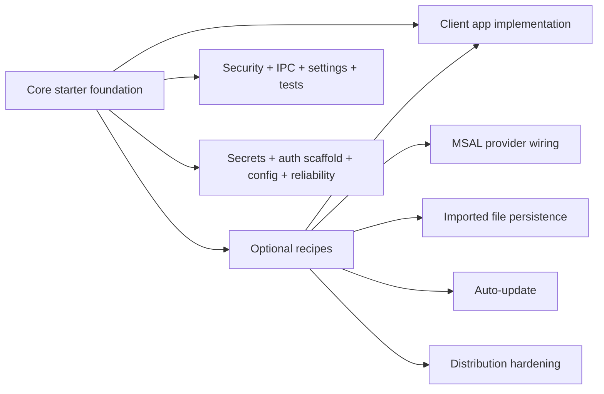

# Roadmap

The roadmap separates core starter infrastructure from optional recipes. Core items should help almost every serious Electron app. Recipes stay opt-in because they depend on product, client, provider, backend, or deployment choices.

## Roadmap Model



## Completed Core Foundation

- Electron runtime security defaults.
- Typed IPC registrar with trusted sender validation and sanitized errors.
- Preload-first renderer API.
- TanStack Router file-based routing.
- TanStack Query factories and hooks.
- Settings persistence through `electron-store`.
- Desktop-aware theme switching.
- Native file dialog and drag/drop demo.
- Native notification preference and delivery flow.
- Window state persistence.
- Main-process logging.
- Vitest and Testing Library setup.
- electron-builder packaging scripts.
- Documentation split between core guides and optional recipes.

## Core Starter Roadmap

These belong in the starter because most production Electron apps need the pattern.

### Safe secret storage

Add a main-process secret-storage module for tokens, API keys, passwords, and refresh material. It should be separate from `electron-store` and backed by Electron `safeStorage` or OS credential storage.

### Auth scaffold

Add provider-neutral auth wiring without locking the starter to Microsoft, Auth0, Okta, or another provider:

- `(auth)` and protected `(app)` route groups
- `window.api.auth` preload API
- `getSession`, `signIn`, `signOut` IPC contracts
- renderer auth query factories and hooks
- main-process provider interface

Provider-specific implementation should remain a recipe until a client app chooses one.

### Typed config

Add documented config boundaries for:

- renderer build-time environment values
- main-process runtime configuration
- secrets that must not ship in renderer bundles
- `.env.example` and validation strategy

### Reliability

Add renderer error boundaries, user-friendly fallback UI, crash/reload guidance, and abnormal-exit diagnostics.

## Optional Recipe Roadmap

These should stay in `docs/examples/` unless a specific app chooses to implement them.

- Microsoft Entra/MSAL provider wiring for OAuth 2.0 authorization code with PKCE.
- Durable imported-file workflow for apps that need app-owned file storage.
- Auto-update recipe for apps that choose an update channel and publishing provider.
- Distribution hardening checklist covering code signing, Electron fuses, custom protocol evaluation, and dependency update policy.

## Decision Rule

Ask this before moving a roadmap item into core:

```text
Would almost every serious Electron app want this exact behavior?
```

If yes, it belongs in the core starter. If no, document it as an example or recipe.
