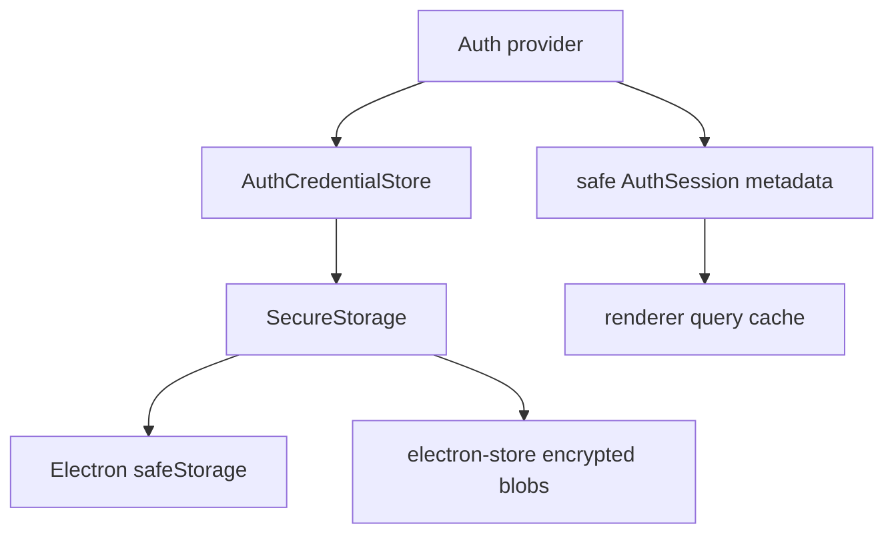

# Secure Storage

The starter includes a main-process secure storage module for sensitive provider-owned values. It is currently used by auth through `AuthCredentialStore`, and it stays behind the IPC boundary so renderer code never sees raw credentials.

## Mental Model



`AuthSession` is safe UI metadata. Secure storage is for provider credential material that should survive app restart.

## Current Implementation

```text
src/main/secure-storage/secure-storage.ts
src/main/secure-storage/secure-storage.test.ts
src/main/auth/auth-credential.store.ts
src/main/auth/auth-credential.store.test.ts
```

`SecureStorage` uses Electron `safeStorage` to encrypt and decrypt string payloads. Because `safeStorage` does not persist values by itself, encrypted base64 blobs are stored in a dedicated `electron-store` file named `secure-storage`.

```ts
const encryptedValue = safeStorage.encryptString(value).toString("base64");
store.set("secrets", {
	...secrets,
	[key]: encryptedValue,
});
```

Only the main process can call this module.

## Auth Credential Store

Auth providers should not choose raw storage keys directly. Use `AuthCredentialStore`:

```ts
await credentialStore.setCredential(provider.id, JSON.stringify(metadata));
const credential = await credentialStore.getCredential(provider.id);
await credentialStore.deleteCredential(provider.id);
```

Keys are namespaced as:

```text
auth:<providerId>:credential
```

This keeps provider data isolated and gives future providers a stable place to store refresh tokens, provider cache blobs, activation secrets, or device credentials.

## Failure Behavior

Secure storage fails closed:

- `set` throws `SecureStorageError` if encryption is unavailable or encryption fails.
- `get` returns `null` for missing or corrupted values.
- `delete` removes only the requested key.
- raw secret values are not logged or exposed to the renderer.

Auth providers should treat `null` from credential restore as "sign in again."

## What Belongs Here

Use secure storage for:

- OAuth refresh tokens
- encrypted provider cache blobs
- activation secrets or license credentials
- API keys entered by a user or administrator
- device-bound provider credential metadata

Do not use secure storage for:

- theme, window bounds, or notification preferences
- public OAuth client IDs
- non-secret app config
- route state or component state
- display-only session fields that are safe in `AuthSession`

## Replacement Notes

Some provider SDKs bring their own OS credential storage. For example, a Microsoft provider may use an MSAL cache plugin instead of this generic store. That is fine: keep the renderer contract stable and replace only the provider's main-process credential implementation.
