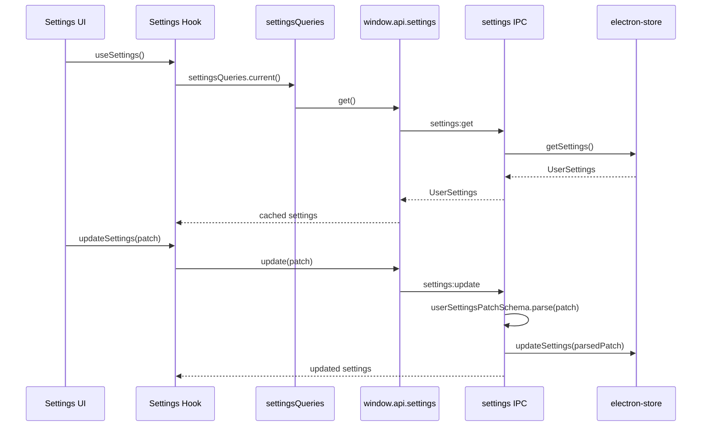

# Settings

Settings are normal, non-sensitive user preferences stored in the main process with `electron-store`. Renderer code reads and writes settings through the typed preload API.

## Data Flow



## Core Files

```text
src/main/settings/settings.types.ts      # schema, defaults, inferred TS types
src/main/settings/settings.store.ts      # electron-store read/update/reset
src/main/settings/settings.ipc.ts        # settings IPC handlers and broadcasts
src/main/settings/settings.channels.ts   # channel/event names
src/renderer/src/core/settings/*         # queries, hooks, tests
src/renderer/src/routes/(app)/settings.tsx
```

## Current Settings Shape

The main settings schema currently owns normal preferences such as theme, desktop notifications, and window bounds. The exact type is inferred from Zod in `settings.types.ts`.

Conceptually:

```ts
type UserSettings = {
	theme: "system" | "light" | "dark";
	desktopNotificationsEnabled: boolean;
	windowBounds: {
		x: number;
		y: number;
		width: number;
		height: number;
		isMaximized: boolean;
	};
};
```

## What Belongs In Settings

Good settings:

- theme preference
- window bounds
- notification opt-in
- startup preferences
- last selected non-sensitive UI options

Do not store:

- access tokens
- refresh tokens
- API keys
- passwords
- document contents
- raw imported files

Sensitive values belong in a future secret-storage module backed by Electron `safeStorage` or OS credential APIs.

## Add A Setting

Example: add a `launchAtStartup` preference.

### 1. Add schema and default

```ts
export const userSettingsSchema = z.object({
	// existing fields...
	launchAtStartup: z.boolean(),
});

export const defaultSettings: UserSettings = {
	// existing defaults...
	launchAtStartup: false,
};
```

### 2. Allow patch updates

```ts
export const userSettingsPatchSchema = z.object({
	// existing patch fields...
	launchAtStartup: z.boolean().optional(),
});
```

### 3. Add UI through hooks

```tsx
const settingsQuery = useSettings();
const updateSettings = useUpdateSettings();

function setLaunchAtStartup(enabled: boolean): void {
	updateSettings.mutate({ launchAtStartup: enabled });
}
```

### 4. Add side effects in the owning feature

If a setting affects Electron APIs, apply that behavior in the feature module or settings IPC handler. Keep renderer UI declarative.

## Broadcasts

Settings updates can be broadcast to renderer windows so query cache stays fresh:

```text
settings:update
  -> updateSettings(patch)
  -> broadcastSettings(settings)
  -> window.api.settings.onUpdated(callback)
  -> queryClient.setQueryData(settingsQueries.current().queryKey, settings)
```

## Tests To Add

- Store test: invalid persisted settings fall back safely.
- IPC test: invalid patches reject with `BAD_REQUEST`.
- Hook test: update mutation calls `window.api.settings.update`.
- UI test: control state follows settings and disables while pending.
