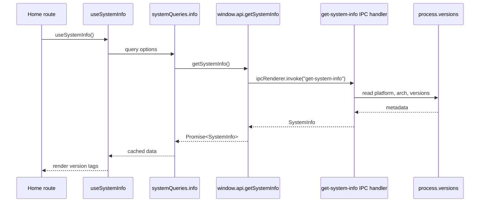

# System Info

The system info feature is the smallest complete example of the starter's IPC + Query pattern. It returns stable process metadata from main to renderer without exposing Electron directly.

## Flow Diagram



## Core Files

```text
src/main/index.ts
src/preload/index.ts
src/preload/index.d.ts
src/renderer/src/core/system/system.types.ts
src/renderer/src/core/system/system.queries.ts
src/renderer/src/core/system/system.hooks.ts
src/renderer/src/routes/(app)/index.tsx
```

## Main Handler

The main process registers stable app/system handlers with the same IPC registrar used by larger features:

```ts
registerIpcHandler({
	channel: "get-system-info",
	handler: () => {
		return {
			platform: process.platform,
			arch: process.arch,
			nodeVersion: process.versions.node,
			chromeVersion: process.versions.chrome,
			electronVersion: process.versions.electron,
		};
	},
});
```

Even simple handlers still get trusted sender validation and sanitized error behavior through the registrar.

## Preload Bridge

Preload exposes a narrow method:

```ts
getSystemInfo: (): Promise<SystemInfo> => ipcRenderer.invoke("get-system-info"),
```

Renderer code never imports Electron or reads `process.versions` directly.

## Renderer Query

System info is stable during an app session, so it can use an infinite stale time:

```ts
export const systemQueries = {
	all: () => ["system"] as const,
	info: () =>
		queryOptions({
			queryKey: [...systemQueries.all(), "info"],
			queryFn: () => window.api.getSystemInfo(),
			staleTime: Number.POSITIVE_INFINITY,
		}),
};
```

## When To Follow This Pattern

Use this pattern for small read-only main-process data:

- app version
- platform metadata
- feature support checks
- build metadata
- read-only capability summaries

If the feature accepts renderer input, add a channel constant, type/schema file, and feature IPC module instead of registering more ad hoc handlers in `src/main/index.ts`.

## Testing

System query tests should verify query keys and preload calls. Main handler behavior is covered through the shared IPC registrar pattern and can be split into a feature module if it grows.
