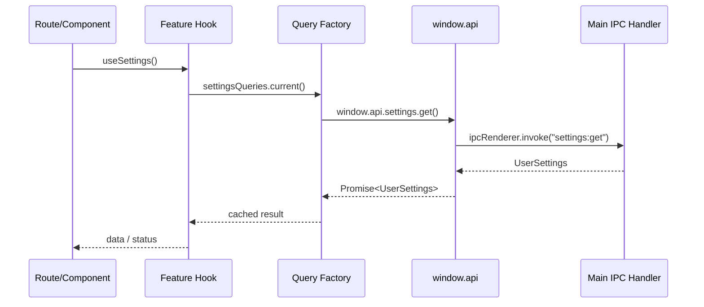

# TanStack Query

TanStack Query owns async renderer state. In this starter, most query functions call the typed preload API instead of HTTP endpoints.

## Wiring Diagram



## How It Is Wired

`src/renderer/src/lib/query-client.ts` exports one app-wide client:

```ts
export const queryClient = new QueryClient({
	defaultOptions: {
		queries: {
			staleTime: 30 * 1000,
			gcTime: 5 * 60 * 1000,
			retry: 1,
		},
	},
});
```

`src/renderer/src/main.tsx` wraps the app:

```tsx
<QueryClientProvider client={queryClient}>
	<ThemeProvider>
		<RouterProvider router={router} />
	</ThemeProvider>
</QueryClientProvider>
```

## Query Factory Pattern

Each feature should keep query keys and preload calls in a query factory:

```ts
import { queryOptions } from "@tanstack/react-query";

export const systemQueries = {
	all: () => ["system"] as const,

	info: () =>
		queryOptions({
			queryKey: [...systemQueries.all(), "info"],
			queryFn: () => window.api.getSystemInfo(),
			staleTime: Number.POSITIVE_INFINITY,
		}),
};
```

Hooks should consume the factory:

```ts
export function useSystemInfo() {
	return useQuery(systemQueries.info());
}
```

Routes and components should consume hooks:

```tsx
function HomeRoute(): React.JSX.Element {
	const systemInfoQuery = useSystemInfo();

	return <span>{systemInfoQuery.data?.electronVersion ?? "Loading"}</span>;
}
```

## Mutation Pattern

Use mutations for commands and writes. Update or invalidate query data after success.

```ts
export function useSetThemePreference() {
	const queryClient = useQueryClient();

	return useMutation({
		mutationFn: (theme: ThemePreference) =>
			window.api.theme.setPreference(theme),
		onSuccess: (themeState) => {
			queryClient.setQueryData(themeQueries.current().queryKey, themeState);
		},
	});
}
```

## Cache Lifetime Rules

Use the narrowest durable state that matches the feature:

- Use component state for local form fields and popovers.
- Use TanStack Query for session state such as selected demo files.
- Use infinite stale time for stable process info and settings that update through events.
- Use main-process persistence for settings that must survive restart.

## Add A Query-Backed Feature

1. Add or reuse `window.api.<feature>` in preload.
2. Add `<feature>.queries.ts` with stable keys and query functions.
3. Add `<feature>.hooks.ts` with `useQuery`, `useMutation`, and event listeners.
4. Use hooks from routes/components.
5. Add tests for query keys, preload calls, and cache updates.

## Testing Example

```ts
it("calls the preload settings API", async () => {
	const queryFn = settingsQueries.current().queryFn as () => Promise<UserSettings>;

	await queryFn();

	expect(window.api.settings.get).toHaveBeenCalled();
});
```

## Rules Of Thumb

- Keep query keys hierarchical and stable.
- Do not call `window.api` directly from broad UI components.
- Let feature hooks hide cache details from routes.
- Keep optimistic updates small and reversible.
- Use event listeners to synchronize main-process broadcasts with query cache.

## References

- TanStack Query: https://tanstack.com/query/latest
- Query options: https://tanstack.com/query/latest/docs/framework/react/guides/query-options
