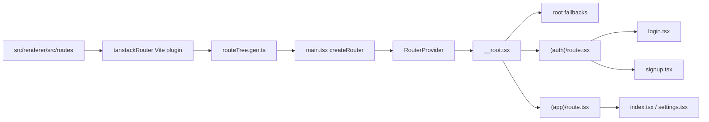

# TanStack Router

The renderer uses TanStack Router file-based routing. Routes are files, layouts are route modules, and the generated route tree gives the app typed navigation.

## Wiring Diagram



## Current Route Shape

```text
src/renderer/src/routes/
|-- __root.tsx          # root route, devtools, query-client context, global fallbacks
|-- (auth)/
|   |-- route.tsx       # auth layout group and auth fallbacks
|   |-- login.tsx       # login route
|   `-- signup.tsx      # signup route
`-- (app)/
    |-- route.tsx       # guarded app shell layout, navigation, and fallbacks
    |-- index.tsx       # home route
    `-- settings.tsx    # settings route
```

`(auth)` and `(app)` are pathless groups. They add layout and guard behavior without adding URL segments.

## How It Is Wired

`electron.vite.config.ts` configures the router plugin:

```ts
tanstackRouter({
	target: "react",
	autoCodeSplitting: true,
	routesDirectory: resolve("./src/renderer/src/routes"),
	generatedRouteTree: resolve("./src/renderer/src/routeTree.gen.ts"),
});
```

`src/renderer/src/main.tsx` creates the router and registers its type:

```ts
const router = createRouter({ routeTree, context: { queryClient } });

declare module "@tanstack/react-router" {
	interface Register {
		router: typeof router;
	}
}
```

The root route provides a global outlet and devtools:

```tsx
export const Route = createRootRouteWithContext<RouterContext>()({
	component: RootLayout,
	errorComponent: RouteErrorView,
	notFoundComponent: RouteNotFoundView,
	pendingComponent: RoutePendingView,
});

function RootLayout() {
	return (
		<>
			<Outlet />
			<TanStackRouterDevtools />
			<ReactQueryDevtools initialIsOpen={false} />
		</>
	);
}
```


## Route Fallbacks

The root route wires global error, pending, and not-found components. The `(auth)` and `(app)` layout groups add more specific error and pending components for their areas.

```text
__root.tsx        -> global error / pending / not-found
(auth)/route.tsx -> auth error / pending
(app)/route.tsx  -> app error / pending + session guard
```

Redirects thrown by TanStack Router are normal control flow. The auth guard uses redirects for missing sessions, while real IPC/query/render failures flow to the nearest error component. See [Error Boundaries](error-boundaries.md).

## Add A Page To The App Shell

Create a route file inside `(app)`:

```tsx
// src/renderer/src/routes/(app)/reports.tsx
import { createFileRoute } from "@tanstack/react-router";

export const Route = createFileRoute("/(app)/reports")({
	component: ReportsRoute,
});

function ReportsRoute(): React.JSX.Element {
	return (
		<main className="mx-auto max-w-5xl px-4 py-8">
			<h1 className="text-2xl font-semibold tracking-tight">Reports</h1>
		</main>
	);
}
```

Add a nav link in `(app)/route.tsx` only when the page should be globally visible:

```tsx
<Link
	to="/reports"
	className={cn(
		buttonVariants({ variant: "ghost", size: "sm" }),
		"text-muted-foreground hover:text-foreground [&.active]:bg-muted",
	)}
>
	Reports
</Link>
```

## Add A Layout Group

Use a pathless group for shared UI without a path segment:

```text
routes/
|-- (auth)/
|   |-- route.tsx      # centered auth layout
|   |-- login.tsx      # /login
|   `-- signup.tsx     # /signup
`-- (app)/
    |-- route.tsx      # protected app layout
    `-- index.tsx      # /
```

Use a real segment when the URL should include it:

```text
routes/
`-- admin/
    |-- route.tsx      # /admin layout
    `-- users.tsx      # /admin/users
```

## Route Loader Pattern

Use loaders for route-level data dependencies only when they are truly route-owned. For regular UI data, prefer feature hooks inside the route component.

```tsx
export const Route = createFileRoute("/(app)/reports")({
	component: ReportsRoute,
	loader: ({ context }) => {
		return context.queryClient.ensureQueryData(reportQueries.list());
	},
});
```

The current starter mostly keeps data fetching in hooks because the shipped routes are interactive demos and settings screens.

## Rules Of Thumb

- Keep layouts in `route.tsx` files.
- Keep pages small; move reusable UI to `components` or feature modules.
- Do not hand-edit `routeTree.gen.ts`.
- Prefer pathless groups for app/auth shells.
- Add route-level navigation only for pages that belong in the global shell.
- Use route-specific error components only when the shared fallback message is not precise enough.

## Checks

After adding or renaming routes, run:

```bash
pnpm typecheck
pnpm build
```

## References

- TanStack Router: https://tanstack.com/router/latest
- File-based routing: https://tanstack.com/router/latest/docs/framework/react/routing/file-based-routing
