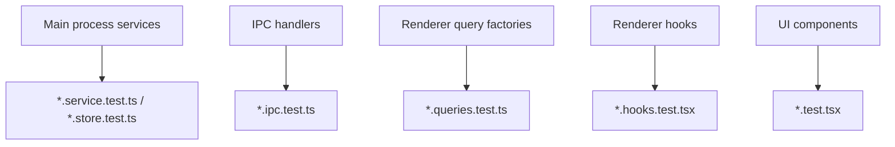

# Testing

The starter uses Vitest and Testing Library. Tests live beside the files they cover so behavior, implementation, and regression coverage stay close together.

## Testing Map



## File Convention

Keep tests beside source:

```text
src/main/settings/settings.store.ts
src/main/settings/settings.store.test.ts

src/main/ipc/ipc-handler.ts
src/main/ipc/ipc-handler.test.ts

src/renderer/src/core/theme/theme.queries.ts
src/renderer/src/core/theme/theme.queries.test.ts

src/renderer/src/components/theme-switcher.tsx
src/renderer/src/components/theme-switcher.test.tsx
```

## Main-Process Service Tests

Service tests should cover pure behavior without launching real windows when possible.

Good targets:

- settings validation and fallback
- window bounds restore logic
- theme resolution with mocked `nativeTheme`
- notification support and focus-aware delivery
- logging configuration and sanitization

Example shape:

```ts
it("falls back when saved bounds are off-screen", () => {
	const bounds = restoreWindowBounds({
		defaultBounds,
		displays: [primaryDisplay],
		fallbackDisplay: primaryDisplay,
		savedBounds: offScreenBounds,
	});

	expect(bounds).toMatchObject(defaultCenteredOnPrimary);
});
```

## IPC Tests

IPC tests should verify registration and boundary behavior:

- registers expected channel names
- validates inputs with Zod
- rejects untrusted senders safely
- converts unknown errors into `INTERNAL_ERROR`
- calls the feature service with parsed input

Example shape:

```ts
const { ipcMain, registerIpcHandler } = createTestRegistrar();

registerSettingsIpcHandlers(registerIpcHandler);

expect(ipcMain.handle).toHaveBeenCalledWith(
	"settings:update",
	expect.any(Function),
);
```

## Query Factory Tests

Query tests should stay small:

```ts
it("uses a stable settings query key", () => {
	expect(settingsQueries.current().queryKey).toEqual([
		"settings",
		"current",
	]);
});
```

Also verify the query function calls the expected preload method:

```ts
const queryFn = settingsQueries.current().queryFn as () => Promise<UserSettings>;

await queryFn();

expect(window.api.settings.get).toHaveBeenCalled();
```

## Hook And Component Tests

Use Testing Library and the helpers in `src/renderer/src/test`. Each test should get a fresh QueryClient so cache state does not leak.

Example behavior to test:

- theme switcher calls the theme mutation
- file upload removes a selected path
- settings controls disable while mutations are pending
- notification hooks call the right preload API

## Commands

```bash
pnpm test
pnpm test:watch
pnpm test:coverage
pnpm typecheck
pnpm lint
pnpm build
```

## Rules Of Thumb

- Prefer service tests for business rules.
- Prefer IPC tests for trust and validation boundaries.
- Prefer query tests for preload contracts.
- Prefer component tests for user-visible behavior.
- Avoid large brittle integration tests for starter infrastructure unless a workflow truly needs it.
