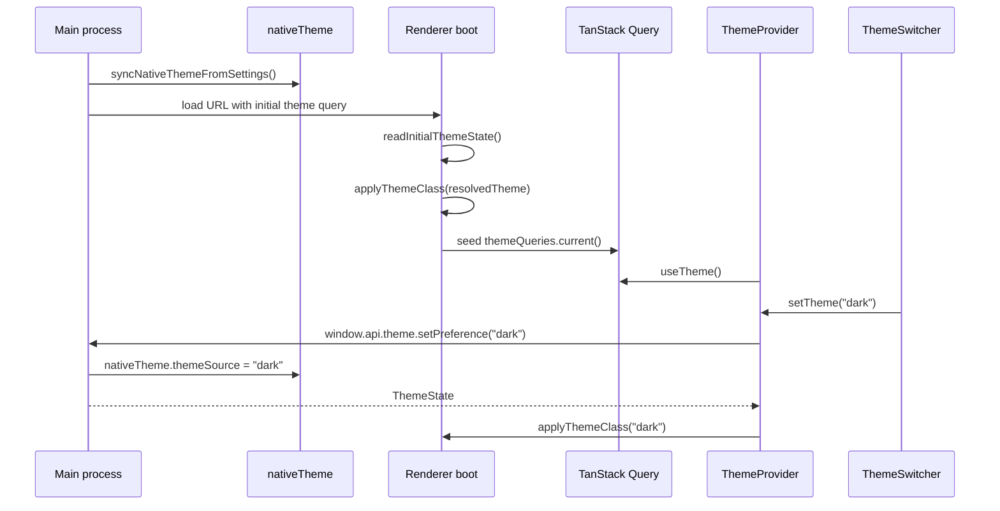

# Theme

Theme state is owned by the main process and resolved through Electron `nativeTheme`. The renderer applies the resolved class for Tailwind and shadcn-style components.

## Flow Diagram



## Core Files

```text
src/main/theme/theme.types.ts
src/main/theme/theme.service.ts
src/main/theme/theme.ipc.ts
src/renderer/src/core/theme/theme.types.ts
src/renderer/src/core/theme/theme.dom.ts
src/renderer/src/core/theme/theme.queries.ts
src/renderer/src/core/theme/theme.hooks.ts
src/renderer/src/core/theme/theme-provider.tsx
src/renderer/src/components/theme-switcher.tsx
```

## Theme State

```ts
type ThemeState = {
	preference: "system" | "light" | "dark";
	resolvedTheme: "light" | "dark";
	systemPrefersDark: boolean;
};
```

`preference` is the user's selected mode. `resolvedTheme` is the actual rendered mode after Electron resolves `system`.

## First-Paint Hydration

The main process resolves theme before loading the renderer:

```ts
const initialThemeState = syncNativeThemeFromSettings();
const initialThemeSearch = new URLSearchParams({
	themePreference: initialThemeState.preference,
	resolvedTheme: initialThemeState.resolvedTheme,
	systemPrefersDark: String(initialThemeState.systemPrefersDark),
});
```

The renderer reads that query state before React renders:

```ts
const initialThemeState = readInitialThemeState();

if (initialThemeState) {
	applyThemeClass(initialThemeState.resolvedTheme);
	queryClient.setQueryData(themeQueries.current().queryKey, initialThemeState);
}
```

This avoids localStorage duplication and reduces light/dark flicker on first paint.

## Runtime Updates

Theme changes use the same IPC/query pattern as settings:

```tsx
const { theme, setTheme, isChangingTheme } = useThemeContext();

<Button disabled={isChangingTheme} onClick={() => setTheme("dark")}>
	Dark
</Button>
```

OS theme changes flow from `nativeTheme.on("updated")` through `window.api.theme.onUpdated`, then the renderer updates query cache and root classes.

## Add Theme-Aware UI

Use tokens and classes that work in both modes:

```tsx
<section className="rounded-lg border bg-card p-4 text-card-foreground">
	<p className="text-muted-foreground">Desktop-aware theme safe UI.</p>
</section>
```

Avoid hard-coded colors unless they are brand colors and have checked light/dark contrast.

## Testing

- Main service tests should mock `nativeTheme` and verify resolved state.
- DOM tests should verify query-string parsing and root class application.
- Provider tests should verify event subscription and cache updates.
- Component tests should verify user interaction through `ThemeSwitcher`.

## Rules Of Thumb

- Do not store theme in renderer `localStorage`.
- Do not import Electron from renderer code.
- Let main process resolve `system`.
- Apply classes through the provider/hook flow, not ad hoc DOM writes.
