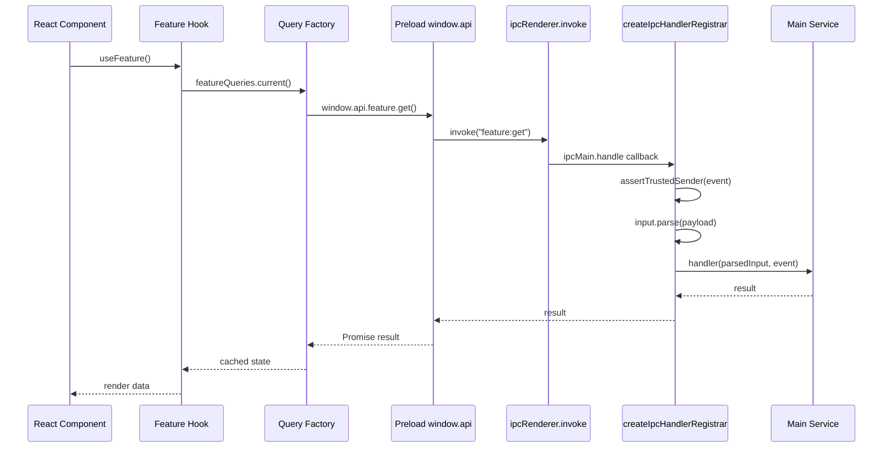

# Typed IPC

Typed IPC is the starter's main process boundary. Renderer code talks to `window.api`; preload turns those calls into `ipcRenderer.invoke`; main handlers validate, execute, and return safe results.

## End-To-End Flow



## Core Files

```text
src/main/ipc/ipc-handler.ts      # shared registrar, validation, sanitized errors
src/main/index.ts                # registrar creation and feature registration
src/preload/index.ts             # contextBridge implementation
src/preload/index.d.ts           # renderer-facing Window.api type
src/renderer/src/core/<feature>  # query factories and hooks
```

## Main Registrar Contract

The shared registrar wraps `ipcMain.handle`:

```ts
registerIpcHandler({
	channel: "settings:update",
	input: userSettingsPatchSchema,
	handler: (patch) => updateSettings(patch),
});
```

For every handler it:

1. Validates the sender frame with `assertTrustedIpcSender`.
2. Parses input with Zod when an input schema is provided.
3. Calls the feature handler.
4. Converts failures into renderer-safe `IpcHandlerError` messages.

Electron only forwards `Error.message` across `ipcRenderer.invoke`, so the stable renderer contract is the message string, for example:

```text
BAD_REQUEST: Invalid IPC request payload.
UNTRUSTED_SENDER: Blocked IPC call from an untrusted sender.
INTERNAL_ERROR: IPC handler failed.
```

## Add A New IPC Feature

Example feature: app profile metadata.

### 1. Channels

```ts
// src/main/profile/profile.channels.ts
export const profileIpcChannels = {
	get: "profile:get",
	update: "profile:update",
} as const;
```

### 2. Types And Schemas

```ts
// src/main/profile/profile.types.ts
import { z } from "zod";

export const profileSchema = z.object({
	displayName: z.string().min(1),
});

export const profilePatchSchema = profileSchema.partial();

export type Profile = z.infer<typeof profileSchema>;
export type ProfilePatch = z.infer<typeof profilePatchSchema>;
```

### 3. Service

```ts
// src/main/profile/profile.service.ts
import type { Profile, ProfilePatch } from "./profile.types";

let profile: Profile = { displayName: "Desktop User" };

export function getProfile(): Profile {
	return profile;
}

export function updateProfile(patch: ProfilePatch): Profile {
	profile = { ...profile, ...patch };
	return profile;
}
```

### 4. IPC Registration

```ts
// src/main/profile/profile.ipc.ts
import type { IpcHandlerRegistrar } from "../ipc/ipc-handler";
import { profileIpcChannels } from "./profile.channels";
import { getProfile, updateProfile } from "./profile.service";
import { profilePatchSchema } from "./profile.types";

export function registerProfileIpcHandlers(
	registerIpcHandler: IpcHandlerRegistrar,
): void {
	registerIpcHandler({
		channel: profileIpcChannels.get,
		handler: () => getProfile(),
	});

	registerIpcHandler({
		channel: profileIpcChannels.update,
		input: profilePatchSchema,
		handler: (patch) => updateProfile(patch),
	});
}
```

Wire it from `src/main/index.ts`:

```ts
registerProfileIpcHandlers(registerIpcHandler);
```

### 5. Preload Bridge

```ts
// src/preload/index.ts
profile: {
	get: (): Promise<Profile> => ipcRenderer.invoke(profileIpcChannels.get),
	update: (patch: ProfilePatch): Promise<Profile> =>
		ipcRenderer.invoke(profileIpcChannels.update, patch),
},
```

Mirror the same API in `src/preload/index.d.ts` so renderer code is typed.

### 6. Renderer Query And Hook

```ts
// src/renderer/src/core/profile/profile.queries.ts
export const profileQueries = {
	all: () => ["profile"] as const,
	current: () =>
		queryOptions({
			queryKey: [...profileQueries.all(), "current"],
			queryFn: () => window.api.profile.get(),
		}),
};
```

```ts
// src/renderer/src/core/profile/profile.hooks.ts
export function useProfile() {
	return useQuery(profileQueries.current());
}
```

## Testing Checklist

- Registrar test: rejects untrusted sender, invalid payloads, and unknown errors safely.
- Feature IPC test: registers expected channels and passes parsed input to the service.
- Query test: query key is stable and query function calls the expected preload method.
- Hook/component test: mutation updates or invalidates query cache correctly.

## Rules Of Thumb

- Never expose raw `ipcRenderer` to the renderer.
- Do not add a generic `invoke` bridge.
- Validate every renderer-provided payload with Zod.
- Keep channel names feature-scoped: `feature:action`.
- Keep sensitive values out of thrown errors and logs.
