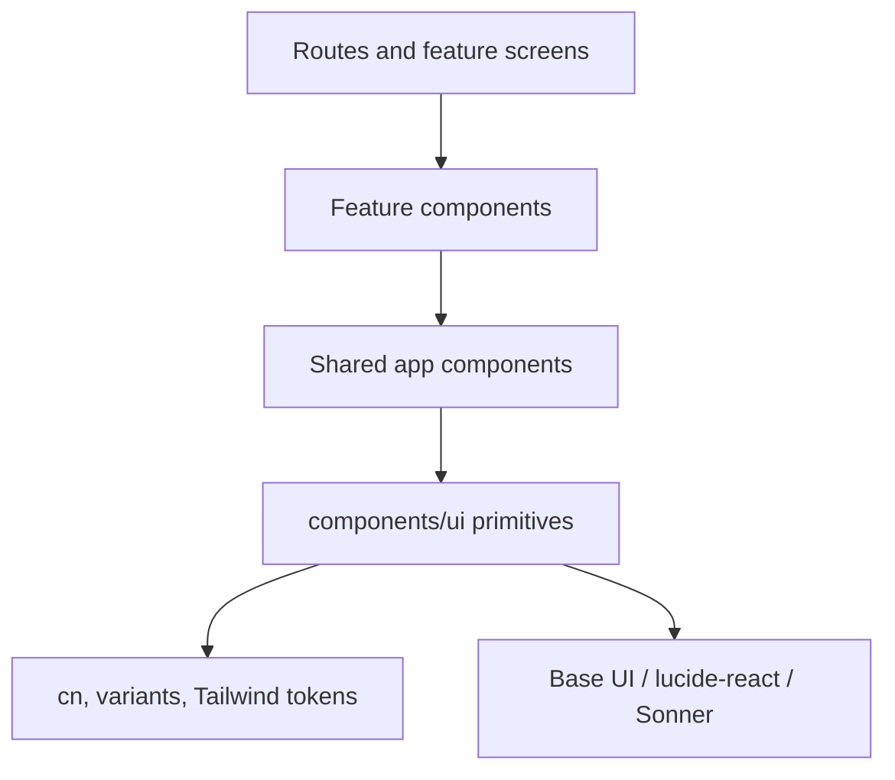

# UI Foundation

The renderer UI is built with Tailwind CSS v4, shadcn-style primitives, Base UI where needed, lucide-react icons, and small local utilities. The starter keeps UI primitives reusable while feature-specific behavior stays in routes or feature modules.

## Component Layers



## Core Files

```text
src/renderer/src/assets/globals.css
src/renderer/src/lib/utils.ts
src/renderer/src/components/ui/*
src/renderer/src/components/theme-switcher.tsx
src/renderer/src/components/ui/file-upload.tsx
components.json
```

## Styling Rules

Use Tailwind tokens and existing primitives before adding new CSS. Shared UI should compose classes through `cn` and variant helpers.

```tsx
import { cn } from "@renderer/lib/utils";

function Panel({ className, ...props }: React.ComponentProps<"section">) {
	return (
		<section
			className={cn("rounded-lg border bg-card p-4 text-card-foreground", className)}
			{...props}
		/>
	);
}
```

Keep color usage token-based so light and dark themes both work:

```tsx
<p className="text-sm text-muted-foreground">Synced with native theme.</p>
```

Avoid hard-coded colors unless they are brand colors and contrast has been checked in both themes.

## UI Primitive Pattern

Primitives in `components/ui` should be small, accessible, and framework-agnostic inside the renderer. They should not know about IPC, TanStack Query, or main-process behavior.

Good primitive responsibilities:

- button variants
- card layout
- alerts and badges
- file input/dropzone UI
- tooltips
- select controls
- toast host

Feature logic should live above the primitive layer.

## Icons And Feedback

Use `lucide-react` for common iconography. Use Sonner for immediate in-app feedback. Native OS notifications should be reserved for background-relevant events and routed through the notification module.

```tsx
import { UploadCloud } from "lucide-react";
import { toast } from "sonner";

<Button onClick={() => toast.success("Files selected")}> 
	<UploadCloud className="size-4" />
	Choose files
</Button>
```

## Add A New Shared Component

1. Put primitive reusable controls in `src/renderer/src/components/ui`.
2. Put app-specific shared components in `src/renderer/src/components`.
3. Keep feature-only components near the route or feature until they are reused.
4. Add component tests when behavior, accessibility, or variants can regress.
5. Keep Electron and IPC calls out of UI primitives.

## Testing

Component tests should verify user-visible behavior and accessibility names:

```tsx
render(<FileUpload selectedPaths={["notes.txt"]} onSelectedPathsChange={vi.fn()} />);

expect(screen.getByRole("button", { name: "Remove notes.txt" })).toBeVisible();
```

## Rules Of Thumb

- Prefer existing primitives before adding new ones.
- Keep cards and panels restrained; do not wrap every section in nested cards.
- Use semantic HTML and accessible labels.
- Keep route screens composed from feature hooks plus presentational components.
- Let theme tokens, not one-off colors, carry the visual system.
