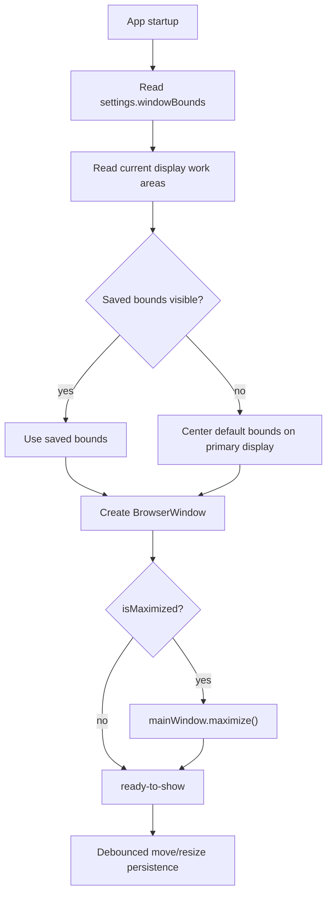

# Window State

Window state is restored and persisted in the main process. The renderer never controls `BrowserWindow` directly.

## Flow Diagram



## Core Files

```text
src/main/window/window-state.ts
src/main/window/window-state.test.ts
src/main/settings/settings.types.ts
src/main/index.ts
```

## Restore Pattern

At startup, `src/main/index.ts` asks the window module for safe bounds:

```ts
const restoredWindowBounds = restoreWindowBounds({
	defaultBounds: defaultSettings.windowBounds,
	displays: screen.getAllDisplays().map((display) => display.workArea),
	fallbackDisplay: screen.getPrimaryDisplay().workArea,
	savedBounds: settings.windowBounds,
});
```

The window is created with those bounds:

```ts
const mainWindow = new BrowserWindow({
	x: restoredWindowBounds.x,
	y: restoredWindowBounds.y,
	width: restoredWindowBounds.width,
	height: restoredWindowBounds.height,
	show: false,
	webPreferences: getSecureWebPreferences(preloadPath),
});
```

## Persistence Pattern

Runtime persistence is registered from main:

```ts
registerWindowStatePersistence(mainWindow, (windowBounds) => {
	const settings = updateSettings({ windowBounds });
	broadcastSettings(settings);
});
```

The module listens to window events, debounces writes, and ignores minimized geometry.

## Restore Rules

- Restore saved bounds only when visible on a current display.
- Fall back to default bounds when saved bounds are invalid or off-screen.
- Restore maximized state after the window is created.
- Do not persist minimized bounds.
- Keep all `BrowserWindow` calls in main process code.

## Add Multi-Window Support Later

If the starter grows multi-window support, do not overload the current single `windowBounds` field. Use keyed window state:

```ts
type WindowStateById = {
	main: WindowBounds;
	preview?: WindowBounds;
};
```

Each window should register its own persistence handler and fallback rules.

## Testing

`window-state.test.ts` should cover:

- valid saved bounds
- off-screen saved bounds
- disconnected monitor fallback
- maximized state
- minimized windows ignored during persistence
- debounce behavior
